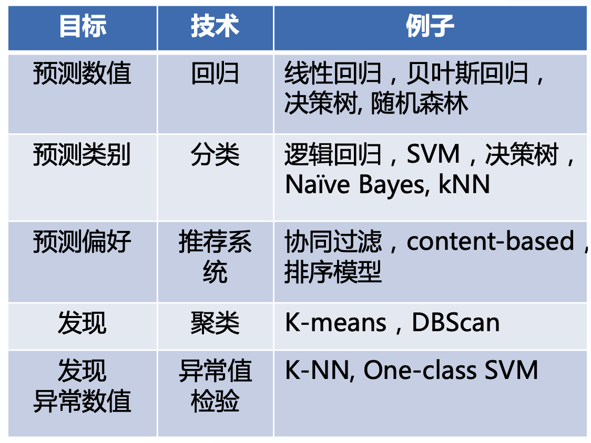
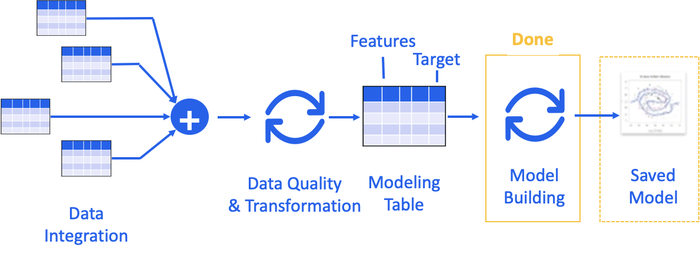

# 机器学习流程

- [1.标准流程](#标准流程)
- [2.比赛流程](#比赛流程)

## 标准流程

### 业务知识

#### 问题定义

- 询问
  - 主要的目标：核心业务问题是什么？是要预测结果还是其他？
  - 量化决策：短期目标 v.s 长期增长
  - 好的指标：对齐目标，可比较、准确、可执行
- 理解
  - 如何衡量成功? SMART，具体、可衡 量、时间限制
  - 影响因子：有什么已知的、可能的影响因子或则限制？
- 翻译
  - 业务目标 -> 技术目标
- 现有方研究案
  - 抽样：用哪部分的样本？
  - 数据变换：有哪些已知的、需要变换的数据？
  - 学习算法：该问题有无合适的学习算法？
  - 模型评估：模型用什么指标评估？

#### 工具选型

- 数据选型
  - 有哪些内部、外部可用的数据？
- 算法选型：不同技术就像工具箱

- 平台选型：选择语言/软件/工具
  - Python、R、Spark、SPSS、SAS

#### 项目计划

- 时间
- 可用资源
- 工具和技术
- 风险和收益
- 项目里程碑（Milestones）

### 特征工程

详见“特征工程”篇

#### 数据获取

拿到数据后第一件事就是确定数据的分布，如果是均匀的那还好，如果是极度不均衡的那就要准备采样方案。有些任务可能需要在已标注数据的基础上重新构造数据集，这种情况需要准备构造方案。

#### 数据探索

也就是熟悉业务的数据。有时候数据并不是我们想象中的样子，比如用户的 query、或者 ASR 之后的文本、或者来自于网页的内容，不同的数据有不同的特色。

用户的 query 可能会有错误，这些错误可能往往是音近或形近导致的，也有可能有拼音输入。ASR 之后的文本可能有很多无效的口气词，当然错误是免不了的，可能更多的是发音不准导致的错误。而网页的文本则一般比较规范，不像 ASR 那么口语化，其中的错误往往也是句法、语义层面的。不同的数据会影响后续的处理以及模型的选择，所以熟悉当前任务的数据是第一步要做的。

**接下来要分析数据与 label 之间的关联性**。以分类任务为例，数据样本和每个 label 之间的关联体现在什么层级？是一些字词就能区分，还是需要字词的顺序？还是需要理解整句语义？是不是需要先进行纠错，不纠错会不会对结果产生影响？只有清楚了这些才有可能选择适合该任务的模型，训练完之后也能够对预期做出检验。比如假设只要单纯地使用字词就可以区分 label，那 TextCNN 也许就完全足够了。如果句子本身可能有一些无效词，那 TextCNN 的效果也许比 Bert  还好。这也很容易理解，因为 Bert 的预训练是建立在正常文本上的，而且是从整体考虑的，对非正常文本这有时候反而会失效。

所以熟悉数据是非常关键的一步。那实际中有什么好的方法吗？这个除了经验外，基本也只能自己去看数据了，而且即便是有经验也最好再熟悉一次，比如不同的 ASR 产品也许犯错的种类不一样呢。实际过程中可以对样本按类别进行均匀采样，然后去观察数据。

#### 数据清洗

主要是去掉一些无关的文本，比如超链接、图片、特殊符号等等。

#### 特征选择

这个主要是处理具体的、特定的文本。比如句子级别的任务中，实体（包括人名、地名、时间、方位等）可能并没有太多意义，部分任务中具体的数字可能需要规范到不同的范围。

#### 数据分拆

标准流程中会将数据分拆为训练集、测试集和验证集。

### 建模训练

所谓建模训练就是从假设空间中寻找一个最优的假设函数 g，使得样本空间的输入 X 经过该假设函数的映射得到的 g(X) 与真实的 label 空间 Y 值之间的评估 metrics 最小（大部分情况下是距离）。这个最优的假设函数只有在少数非常简单的场景中可以直接计算所得，在大部分场景中通常没法直接计算得到，需要用数值计算的方法不断迭代求解。因此如何寻找 g 函数的全局最优解，以及使寻找过程尽量高效，就构成了机器学习的建模训练。

完整的建模训练过程归结为以下步骤：

1. 学习算法确定：确定学习算法及其超参。
2. 模型训练：基于“学习算法”给定的超参，在训练集上训练模型的普通参数，使得训练所得模型及其参数在训练集上的损失函数/误差降低到可接受的程度。
3. 学习算法验证：在验证集上验证训练所得模型的性能（泛化能力），并根据模型性能对“学习算法”的结构或其超参进行调参。

以上 2、3 两步循环执行，直至训练所得模型在验证集上取得较好的性能（较低的泛化误差），此时完整的训练过程结束。在完成“模型训练”和“学习算法训练”后，才会在测试集上测试训练所得模型的性能。

#### 学习算法确定

- 学习算法选择：对于训练，有多个“学习算法”可以选择（也可以被称为通用模型），对于同一类“学习算法”，也有多种结构即“超级参数”可以选择。当使用不同的“超参”时，也会产生不同的“学习算法”。最正常的做法应当先使用训练集来学习、验证模型，再使用验证集来调整“学习算法”及“超参”。
- 超参设置：“学习算法”的调参除了对算法进行选择外，还需要对“学习算法”的“超参”进行设定，可以基于验证集对特定参数的“学习算法”训练出的模型进行性能评估。
  - 学习算法结构：
    - 例如，选择“深度神经网络”作为“学习算法”，而 DNN 的层数以及每层的 neuron 数。
    - 例如，决策树的深度
  - 选择模型的性能评估方式：确定模型的损失函数，用来判断这个模型的效果，主要是为了看模型输出的结果跟真实结果的差别，差别越小效果越好。
- 调参：俗称炼丹，主要是对同一个模型使用不同的超参数，比如 Embedding 维度，TextCNN 的 Kernel Size、Filter  Size，Bert 的层数，各种 hidden size、激活函数等等。除此之外，还应该包括部分组件的调整，比如增加归一化、使用 Dropout 等等。使用不同参数前依然应该遵守分析数据的方法，假定参数调整了结果会咋样，然后通过实际结果去验证假设。

#### 模型训练

这步是在确定了学习算法及其“超参”之后，使用该“学习算法”训练具体的模型。对于同一个“学习算法”，可能会产生不同的模型，理想的选择方式是对模型的性能（例如泛化误差）进行评估，然后选择性能最好（泛化误差最小）的那个模型。

1. 直接计算最优参数：对于一些比较简单的场景，可以根据损失函数直接计算得出在假设空间中的最优模型。

2. 迭代比较获得最优参数：基于训练集迭代训练模型。

#### 学习算法验证

学习算法验证是通过验证测试来对训练所得模型进行评估、验证。在模型验证中用到的数据集被称为验证集，基于验证集上的性能来进行模型的评估与选择。具体操作是选择一个验证集来测试模型对新样本的判别能力，然后以验证集上的误差作为泛化误差的近似。将训练得出的模型应用于验证集上，从而评估训练所得模型的性能（泛化误差）。然后基于性能评估结果调整训练方案或“学习算法”的超参。

如果验证集性能评估差（泛化误差大）：

- 训练集性能也差（泛化误差大）-> 训练所得模型欠拟合：模型太简单或缺少关键特征
- 训练集性能好（泛化误差小）->
  - 训练集、验证集数据分布有问题：调整测试集数据分布，重新训练模型
  - 训练所得模型过拟合：
    - 1/ 收集更多数据
    - 2/ 降低模型的复杂度，替换使用复杂度较低的训练模型，例如用线性回归替换多项式回归

### 工程实现

#### 模型部署

这里主要指将一个或多个深度学习模型部署为微服务，主要有以下好处：

- 部署使用分离：所有的推理都通过 RPC 或 RestFul 接口实现，与模型部署无关，甚至与模型本身也无关，服务模块只关心输入和输出。当需要更新模型时，只需将新模型放到对应位置即可，代码层面不用做任何改动。
- 合理利用资源：所有的模型可以统一部署到一个服务下，共享同一个服务器资源。因为模型一般是用 GPU 服务器，而普通的服务一般是用 CPU 服务器，这样的部署方式能够更合理地利用资源。
- 统一管理监控：因为所有的模型逻辑上都在一起，所以无论日常的管理还是数据的监控，实施起来都比较方便。

在部署时，推荐使用容器化部署方案，使用 k8s 或类似的集群框架对服务进行管控，主要是考虑到以下几个优点：

- 部署方便：完全不用考虑不同环境可能造成的冲突，所有的服务相互隔离。部署时通过 YAML 配置服务，实现一键全自动部署。
- 便于扩展：水平扩展可以直接添加实例，垂直扩展修改资源限制，所有配置均可通过配置文件完成，完全实现资源配置化。而集群资源不够时，直接添加节点主机即可。
- 便于管控：通过 Istio 等组件非常容易实现流量和服务管控。比如可以很容易地配置实现灰度发布，进行线上 A/B 测试，而且这些功能都是和业务解耦的。
- 节约资源：因为集群的服务其实是共享节点资源的，所以高峰时期服务会自动多占用资源（当然不会超过配置的限制），低谷时期就自动释放资源。这样其实最大限度地利用了可利用的资源，节约了成本。
- 管理方便：从管理机器变成管理服务，只要配置好相应的服务，机器只是无状态的节点，多一个少一个挂一个重启一个对服务没有影响。而且集群还支持非常细粒度的权限控制，使用权限可以按需下发到部门或个人。

#### 数据可视化

- 结果展示
  - 效果指数
    - 离线指标：准确率、AUC、RMSE、Lift Chart
    - 在线指标：参与人数、ARPU、总收入、在线时长
  - 解释结果
    - 比较现有模型/业务规则
    - 影响因子重要性
    - 每个因子跟目标Y的关系
- 可视化展示

#### 监控维护

主要可以分为两个方面：数据流转和服务负载。

数据流转是指流程中各个节点的输入和输出情况，节点可能是某一个服务，也可能是一个组件，甚至是一个模型，关注的是流转的内容是否正常。服务负载是指流程中各个节点的流量情况，关注的是流量的大小。这块内容之前涉及的很少，只是简单地用过一下 Istio，暂时也没有太多的感受。先记录几个自己的直观认知。

- 配置化。主要针对运维，理想状态下每个模块都有对应的配置文件，整个系统的组织就是对配置文件的组织。这在 k8s  里面是自然的，我们可以通过配置文件很方便地指定环境变量、资源配置、服务策略等，然后可以用命令行工具一键（或自动）启动或更新。与此相反的是人工手动操作或代码里写死，要尽量避免类似的行为，如果需要通过外部变量影响模块内部行为或模式，最好将这些变量映射到外部配置文件。
- 系统化。主要针对监控，当我们设计监控系统时，不仅要考虑关注的节点，还要考虑这些节点状态信息如何传输、存储、读取、展示，以及数据的流动是否会影响系统性能等多个方面。可以做个很简单的实验，一个简单的循环操作，每个循环打印结果和不打印结果性能会相差数十倍，如果要写信息，性能相差可能会更大。一个反面的例子就是无脑打印日志，不仅充斥着大量乱七八糟的无效信息，还严重影响性能。

- 效果监控
  - 随着时间效果是否衰减
  - 预测值分布的变化
- 维护
  - 模型维护计划
  - 增加新数据源
  - 版本更新
- 测试
  - 测试计划和执行
  - 实验设计：A/B Test、Fractional Factorial

## 比赛流程

### 业务知识

#### 问题定义

具体了解业务问题

#### 工具选型

同上

#### 比赛计划

时间安排
人员分工

### 特征工程

同上

- 数据获取

- 数据探索

- 数据清洗

- 特征选择

- 数据分拆：标准流程中会将数据分拆为训练集、验证集、测试集（private、public）。

  - train（labeled）

  - val（labeled）

  - test（labeled）

    - public（unlabeled）

    - private（unlabeled）

- 评估方式探索：探索对测试集的评估方式

### 建模训练

#### 学习算法确定

同上

#### 模型训练

同上

### 学习算法验证

同上

### 模型提交

测试模型效果

- 模型应用：正式使用顺利所得的最优模型对测试数据集进行预测
- 评估结果：
  - 预测准确性
  - 可解释性
  - 运行时间
  - 部署难度

#### Public/Private 提交

为了防止比赛人员通过多次上传结果利用测试集调参，所以在比赛中还会将测试集分为 public 和 private 测试集。其中 public 用于让参赛人员不断的验证自己模型的效果，而 private 则用于最后的成绩评估。

## Ref

1. [一个「菜鸟」转行AI的成长心得！](https://mp.weixin.qq.com/s/p65FvXQxXMEFFXwMBAYJTg)
2. 
