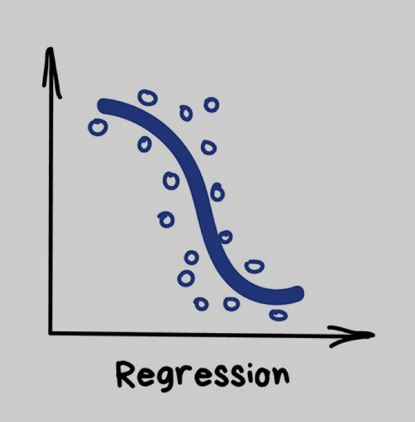
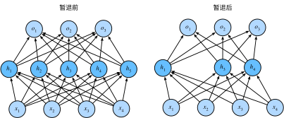

#  简介

## 人类发展阶段

人类文明发展至今，人类劳动一直是一类关键生产要素。工业时代，机器替代了农业和工业生产中的重复性人类劳动，变为人机协同的方式，让工业农业产出大幅度增加，但需要的工作人口大幅度减少。同样的道理，GPT 的诞生，计算机将会替代重复性的脑力劳动，增强了人机协同中机器的成分，让行业产出大幅度增加。

### 人的三位一体

分析这轮新范式，首先是要理解一个稳定的内在结构体系“三位一体”。“三位一体”体系结构源自于复杂学。在复杂学理论中，我们每个人都是一个复杂体系，一个组织是一个复杂体系，人类社会是复杂体系，数字化系统也是个复杂体系，任何复杂体系都有 3 个子系统：信息（绿色）、模型（蓝色）、行动（红色）。

- 信息系统-感知：从环境当中获得信息。
- 模型系统-思考：知识（knowledge），对信息做一种表达，进行推理和规划。模型就是人在垂直领域的认知体系、每个人都是 3 种模型的组合：
  - 认知模型：能看、能听、能思考、能规划
  - 任务模型：能爬楼梯、搬椅子剥鸡蛋
  - 领域模型：有些人是医生，有些人是律师，有些人是码农
- 行动系统-实现：最终和环境做交互，达到人类想达到的目的。

“三位一体”内在结构体系的底部，是数字化产业过去 50 多年每一个年代它的发展平台，包括个人电脑、PC、Web-2、移动互联网、云计算、AI、元宇宙等时期。

### 技术演进

#### 第一代系统

- 组成

  - 系统：信息

  - 人类：模型+行动

- 拐点（1995年）：获取信息的边际成本开始变成固定成本（拐点定义：任何改变社会、改变产业的，永远是结构性改变。这个结构性改变往往是一类大型成本，从边际成本变成固定成本。）

在1995年-1996 年间，IBM、微软等公司出现了一个大的拐点，之后出现了一轮震荡变阵。拐点之后，信息系统呈爆发式增长，诞生了许多伟大的企业，如谷歌、苹果、亚马逊等。而发生拐点的根本原因是它的成本结构变了。

##### 软件

- 拐点：软件让很多工具分发的边际成本降为0。

##### 互联网

将信息自动化、信息的搬运

- 拐点：互联网让很多信息/内容分发的边际成本降为0。

##### 移动互联网

iPhone让手机变成了人类器官的延伸，并且让互联网从桌面走到了身边。

##### 社交网络

将人际关系数字化

#### 第二代系统

- 组成

  - 系统：信息+模型

  - 人类：行动

- 拐点（2022）：大模型的成本从边际走向固定。知识创造就是模型和知识的获取，它结构性做演变了，让智力分发的边际成本降为0。
- 影响：生产资本提升，用来生产的资源越来越多。
  - 广泛提高：所有动脑筋的工作，可以降低成本、提升产能。让“智力分发”的边际成本趋近于零，人力资本的杠杆变得无限大。码农成本会降低，但对码农的需求会大量增加，码农不用担心。因为对软件的需求会大量增加，就是这个东西便宜了，都买嘛。软件永远可以解决更多问题，但有些行业未必。
  - 深层提升：有一些行业的生产资本本质是模型驱动，比如医疗就是一个模型行业，一个好医生是一个好模型，一个好护士是一种好模型。医疗这种产业，本质是强模型驱动。现在模型提高了，科学也随之提高。我们的产能将本质性、深度提高。产业的发展速度会加快，因为科学的发展速度加快了，开发的速度加快了，每个行业的心跳都会加快。

##### ChatGPT

#### 第三代系统

- 组成

  - 系统：信息+模型+行动

  - 人类：无

- 原理-AGI通用智能：能让 AI 从有限任务变成几乎能取代或协助人类的所有思考任务。

  - 涌现（emergence）：指在一个复杂系统中，由于各个组成部分之间的相互作用，出现了新的、超越各个部分本身的行为或性质。在通用智能中，涌现是指智能行为是由系统中较低层次的行为和相互作用组合而成的。通常，这种智能行为并不能直接从系统的单个组件中观察到。

  - 代理（agency）：指一个具有自主决策和行动能力的实体。在通用智能中，代理是指一个能够基于其环境和目标自主决策、学习、推理和解决问题的实体。代理可以是人类、动物或者人工智能系统。

  - 功能可见性（affordance）：指环境中的物体或场景所具有的潜在功能或可以提供的行动机会。在通用智能中，功能可见性是指一个智能代理应该能够识别其环境中的物体或场景所提供的可能行动或功能，并根据这些行动或功能来做出合适的决策。

  - 具象（embodiment）：指将智能系统与物理或虚拟环境中的实体结合在一起，使其能够与环境进行感知、交互和行动。在通用智能中，具象强调了智能系统需要与其所处环境相互作用，以便更好地理解、学习和适应环境。具象可以是物理的，如机器人与现实世界的互动；也可以是虚拟的，如AI系统在虚拟环境中与其他实体交互。

##### 自动驾驶

##### 镜像世界

将使世界上剩余的其他东西统统数字化，并且在现实世界之上叠加语义。真实的和虚拟的客体重叠在一起，其信息可以实时显现在用户眼前。仿佛在三维空间的基础上增加信息这一维度，创造出一个思维世界。在镜像世界中，身处不同地点的人可以在全球实时构建虚拟世界。它可以帮我们利用 AI 和算法帮助我们搜索现实世界。

### 社会演进

在更长的历史视角中，这种情况基本上是一个不断的趋势：曾经需要人类努力完成的东西最终变成了自动化和通过技术“免费完成”的事情。这在思想领域中有一个直接的类比：随着时间的推移，越来越高级别的抽象水平被开发出来，这些水平消除了以前的繁琐细节和具体问题。

#### 原始文明

200多万年

#### 农业化

4000多年

- 经济类型：农业经济。
- 人的作用：体力为主。
- 工具：简陋。
- 代表职业：农民。

#### 工业化

300多年

工业化是人身体的延伸

- 经济类型：商品经济。
- 人的作用：体力为主、脑力为辅，人类身体的延伸。
- 工具：机械、电器、电子设备。
- 代表职业：工人。

在工业社会早期，人是需要做大量的体力劳动，工业社会所带来的一代一代的技术、机械设备、电子设备、电气设备等等，让人的体力劳动逐步降低。

##### 机械化

- 1760-1840
- 英国：蒸汽革命

##### 电气化

- 1840-20世纪初
- 美国：电器化

##### 自动化

- 1950-21世纪初
- 日本、德国：自动化

#### 数字化

数字化是人脑的延伸

人基本上就是在认识世界，改造世界。人是减熵的物种，我们用数字化来延伸自己。数字化产业一直在驱动着这个阶段人类的进步。

##### 信息化

信息无处不在

- 经济类型：服务经济。
- 人的作用：脑力为主、体力为辅，人类感官的延伸，如：iphone就是人类感官的延伸。
- 工具：自动化程度加深。
- 代表职业：设计师、分析师、码农。

信息社会从手机也好，电脑也好，带来大量的信息，造成了我们社会从商品经济进入今天的服务经济，我们都用信息、用脑力劳动来产生商业与社会价值。因此，今天我们社会最有代表性的职业是码农、是设计师、是数据分析师等。

##### 知识化

模型无处不在

- 经济类型：体验经济。
- 人的作用：创新为主、其他为辅。
- 工具：数字化的认知能力（大模型）。
- 代表职业：创业者、科学家、艺术家，他们会让所有服务经济中的人、蓝领基本都受影响，因为他们是模型，除非有独到见解，否则你今天所从事的服务大模型都有。

2022-2023 年蓝色发展曲线上，正在由Sam Altman成立的OpenAI公司和微软引领，以及其他创业公司共同参与创造的拐点，这个拐点的背后一项新的基础技术出现，它叫“大模型“。主要原因是模型成本发生了结构性变化，即模型成本从边际成本发展为固定成本。

模型跟信息一样，是一个影响我们所有一切的核心产能，因此模型成本很重要。在社会当中。生产任何东西都需要信息，而这一次是模型信息知识，我们做任何一件事情都需要知识，知识的力量是无穷的，相比于信息时代，模型的产能更强大，发展的速度一定会比过去更快。

模型与每个人都有关。从我们的社会互动和社会产业价值角度来讲，认知、任务、领域、场景等模型非常关键。模型将无处不在，知识将无处不在。今天我们打开手机、打开任何一个设备，信息过来了；以后打开任何一个设备，是模型过来了。医生诊断是模型，律师服务是模型，设计师是模型，艺术家是模型，方方面面它都无处不在。同时，一个企业、一个城市、一个国家，他们所要解决的问题都是领域模型场景模型，从而一系列伟大的公司会因此诞生，他们将付出固定成本，他们将发明新的商业模式，最后我们整个产业+变革，产生新的世界。

在知识化时代，未来服务经济很快就会变革，因为我们所做的一切脑力劳动，除非你有特殊的认知、特殊能力，未来都将从根本意义上被改变。**因为这一次模型的成本大大降低，我们将很快从一个服务经济，进入到一个体验经济。**

能力有100分的话，应该说80分大模型都会吃掉，当你进入一个全新的领域，比如中医领域，通过AI的能力，可能迅速具备老中医80分的水平，但是80—100分之间还是要老中医的。我感觉大部分行业都会发生这样的变化，特别是在那些本来就用模型构建知识体系的行业，医生、律师、设计师，以前你要进行大量的训练、临摹，其实就是在练这个模型，那未来可能会有问题。

##### 自主化

行动无处不在

智能自主：通常是自动化的自然终点。

- 原则上，智能体可被用于自动化任何其他过程。不难想象，一旦这些智能体变得高度精密、可靠，各个领域和行业的自动化程度将呈指数级增长。」 —— 英伟达机器学习专家 Bojan Tunguz
- 「人们常常会浪费过多的时间来做繁琐乏味的手工工作，而当计算机可以完成这些工作时，人们便可以被解放出来去实现更具创造性的追求，或者去做目前只有人类才能做的事情。自主智能体将使人们能够在更短的时间内完成更多的工作，并且，随着时间的推移，人们盯着屏幕工作的时间也有望缩短！」 ——Redpoint 常务董事 Erica Brescia

自主智能体：是由 AI 赋能的程序。当给定一个目标时，它们能够自行创建任务、完成任务、创建新的任务、重新确定任务列表的优先级、完成新的首要任务，并不断重复这个过程，直到完成目标。

- 经济类型：AI 经济。
- 人的作用：创新探索。
- 工具：数字化的自主行动能力。
- 代表职业：人类新价值系统。

这一次的模型体系可以控制一切东西，控制机器人、控制自动驾驶、控制空间计算。而未来人类行动的一切将是三个体系的组合：机器人、自动驾驶和数字化的空间计算。

要引领下一个拐点，特斯拉目前处在非常优势的地位，因为它在机器人技术、自动驾驶技术、人工智能技术方面的整体布局相当完整，其他公司会不会参与下一波，抢占下一个拐点？我们拭目以待。

### 科学范式

科学研究方法

定义：用来描述科学研究的基本观念、方法和实践。首先出自《科学革命的结构》，科学进步不是通过渐进的知识积累实现的，而是通过一系列革命实现的，其中一种主导范式会被另一种替换。

- 第一范式-科学实验：这是传统的科学方法，依赖于直接观察和实验来收集数据和发现知识。
- 第二范式-模型归纳：科学家们开始使用更复杂的理论模型（例如数学和物理模型）来解释观察到的现象。
- 第三范式-模拟仿真：随着计算机的出现，科学家们开始使用计算模型来模拟现象，并通过这种模拟来理解和预测现象。
- 第四范式-数据密集型：科学研究开始依赖于大数据和机器学习来从大规模的数据集中发现模式和知识，这个阶段的科学研究方法通常被称为"数据科学"。机器学习（我把深度学习归为机器学习一个更高模型复杂度的分支）的思想如下：1/ 开发者不指定规则；2/ 开发者收集一批训练数据，告诉 AI，然后让 AI 自己从中归纳出高准确率的规则；3/开发者把 AI 思考出来的规则部署到线上。
- 第五范式-人工智能/自动化科学：科学发现和知识生成的过程可以被自动化，而不需要直接的人类参与。

如今科学已高速进入了第四的数据驱动、第五的计算驱动即大模型驱动阶段，对人类发展结构产生根本影响。

## 术语

### ML VS AI

1956 年提出 AI 概念，短短 3 年后（1959）[Arthur Samuel](https://en.wikipedia.org/wiki/Arthur_Samuel) 就提出了机器学习的概念：机器学习研究和构建的是一种特殊算法（而非某一个特定的算法），能够让计算机从经验数据中产生“模型”，基于模型对新的数据进行预测。机器学习的原理是把现实生活中解决问题的“经验”抽象成数学模型，并且很清楚模型中不同参数的作用。在本文中用“模型”泛指从数据中学得的结果。

AI 是目标，而机器学习 ML（Machine Learning）是实现 AI 的方法，它是计算机基于数据构建概率统计模型并运用模型对数据进行预测与分析的学科。ML 所研究的是关于在计算机上从经验数据中产生模型（model）的“学习算法”。有了“学习算法”，就可以把经验数据提供给它，它就能基于这些经验数据产生模型。在面对新的情况时，模型可以提供相应的判断。

- AI 人工智能：整个学科的名称，类似于“生物学”或“化学”，通过机器模拟人类认知 – 感知、学习、推理、决策。
- Data Mining 数据科学/挖掘：数据科学（Data Sciense） = 数据 + 科学，是从数据中获取信息的科学，其交叉领域包括计算机、统计及专业知识。它利用机器学习和统计学等技术，从大量数据中提取有效信息、模型。
- 统计：从数据中获取有用的信息，用于数理统计和应用统计（描述统计、推论统计），它被认为是实现 ML 的一种方法，所以很多统计的工具会用到 ML 上。
- ML 机器学习：是人工智能的重要组成部分，但不是唯一的部分。它是一种让机器可以从经验中学习的技术。它研究和构建的是一种特殊算法，能够让计算机从经验数据中产生“模型”，基于模型对新的数据进行预测。
- 深度学习：是关于构建、训练和使用神经网络的一种现代方法，AI系统需要具备自己获取知识的能力，即从原始数据中提取模式的能力。本质上来讲，它是一种新的架构。在当前实践中，没人会将深度学习和“普通网络”区分开来，使用它们时需要调用的库也相同。

### 数据挖掘 vs. ML

实际上数据挖掘和机器学习在很大程度上是重叠的。一些常用算法，比如 K-Means、KNN、SVM、决策树和朴素贝叶斯等，既可以说是数据挖掘算法，又可以说是机器学习算法。

- 数据挖掘：知识模型。数据挖掘通常是从现有的数据中提取规律模式（pattern）以及使用算法模型（model）。核心目的是找到这些数据变量之间的关系，因此也会通过数据可视化对变量之间的关系进行呈现，用算法模型挖掘变量之间的关联关系。通常情况下，只能判断出来变量 A 和变量 B 是有关系的，但并不一定清楚这两者之间有什么具体关系。在谈论数据挖掘的时候，更强调的是从数据中挖掘价值。
- 机器学习：经验模型。机器学习是人工智能的一部分，它指的是通过训练数据和算法模型让机器具有一定的智能。一般是通过已有的数据来学习经验，并通过各种算法模型形成一定的“处理能力”，如分类、聚类、预测、推荐能力等。这样当有新的数据时，就可以通过训练好的模型对这些数据进行预测，也就是通过机器的智能完成某些特定的任务。

### 大数据 vs. ML

大数据已经沦为 ML 中特征工程的工具

### 函数 vs. 概率

函数和概率可以看成一回事

- Deterministic 函数 $y=f(x)$：是 x 对应唯一的值 y
- Probabilistic 概率 $P(y|x)$：是 x 对应一组值 y 的分布。对于某一 x，y 的可能值可以是 f(x) 附近的多个。概率有更高的不确定性，而这个不确定性则是来自 noise。

### 判别式 vs. 生成式

- 判别方法：由数据直接学习决策函数或条件概率分布。其基本思想是在有限样本条件下建立判别函数，不考虑样本的产生模型。不能反映训练数据本身的特性，但它可以寻找不同类别之间的最优分类面，反映的是异类数据之间的差异。
- 生成方法：从数据学习“联合概率密度分布”，然后求出条件概率分布作为预测模型，这类方法需要样本非常多时才能很好的描述数据的真正分布。之所以成为生成方法，是因为模型表示了给定输入 X 产生输出 Y 的生成关系。它从统计学的角度表示数据的分布情况，能够反映同类数据本身的相似度，但不关心划分各类的边界在哪里。

机器学习的任务是从属性 X 预测标记 Y，即求概率 P(Y|X)：

- 判别式模型：知晓所有标签，返回最有可能的一个标签。它求得条件概率 P(Y|X)，对未见示例X，根据P(Y|X)可以求得标记Y，即可以直接判别出来。如图的左边所示，实际是就是直接得到了判别边界，所以传统的、耳熟能详的机器学习算法如线性回归模型、支持向量机SVM等都是判别式模型，这些模型的特点都是输入属性X可以直接得到Y（对于二分类任务来说，实际得到一个score，当score大于threshold时则为正类，否则为反类）。从另一个角度来说，判别式对于某示例 $x_1$，对正例和反例的标记的条件概率之和等于1，即 $P(y_1|x_1)+P(y_2|x_1)=1$。判别模型之所以称为“判别”，是因为其根据 X “判别” Y。
- 生成式模型：独立计算某几个标签的概率，然后做比较。它求得联合概率 P(Y,X)，对于未见示例 X，求出 X 与不同标记之间的联合概率分布，然后概率最大的获胜。如图右边所示，并没有什么边界存在，对于未见示例（红三角），求两个联合概率分布（有两个类），比较一下，取那个大的。机器学习中朴素贝叶斯模型、隐马尔可夫模型 HMM 等都是生成式模型。熟悉Naive Bayes的都知道，对于输入 X，需要求出好几个联合概率，然后较大的那个就是预测结果。也就是说，对于某示例$x_1$，对正例和反例的标记的联合概率之和不等于1，即$P(y_1,x_1)+P(y_2,x_1)<1$。要遍历所有的X和Y的联合概率求和，即 $\sum P(X,Y)=1$。生成模型之所以称为“生成”，是因为其预测的根据是联合概率P(X,Y)，而联合概率可以理解为“生成”(X,Y)样本的概率分布。 

举例来说，要确定一只羊是山羊还是绵羊。用判别模型的方法是从历史数据中学习到模型，然后通过提取这只羊的特征来预测出这只羊是山羊还是绵羊。利用生成模型是根据山羊的特征首先学习出一个山羊的模型，根据绵羊的特征学习出一个绵羊的模型，然后从这只羊中提取特征，分别放到山羊和绵羊的模型中做预测，然后比较哪个概率大。判别式模型是根据一只羊的特征可以直接给出这只羊是山羊的概率（比如logistic regression，这概率大于0.5时则为正例，否则为反例），而生成式模型是要都试一试，最大的概率的那个就是最后结果。

## ML发展阶段

在很久以前，古人就开始思考世间万物中，是否只有人类具有智慧这一问题。在文学作品中，古人也创造了很多动植物通灵的形象。时光荏苒，转到达尔文时代，人类社会终于达成共识，人类（灵长目）是地球上唯一具有智慧的生命体，堪称万物之长。放眼浩瀚宇宙，也只有外星人这一未知是否的存在，才可能与人类智慧相匹敌。

而对于机器能否思考这个问题，答案显而易见。笛卡尔在1637年的《访谈方法》中预言了图灵测试。他指出，机器能够与人类进行交互，但是这样的机器不能做出适当的反应，但是任何人都可以。因此笛卡尔借此区分机器和人类。笛卡尔没有预想到几百年后机器的语言能力未来能被克服。

在 AI 历史上划时代的 1956 年达特茅斯会议之前，就已经有很多业内的顶尖学者开始逐步探索人工智能这一宏大领域。1950 年，图灵发表了一篇里程碑的论文《computing machinery and  intelligence》，文中预言了创造出具有真正智能的机器的可能性。由于注意到“智能”这一概念难以确切定义，他提出了著名的图灵测试：如果一台机器能够与人类展开对话（通过电传设备）而不被辨别出其机器身份，那么称这台机器具有智能。我们人类文明几千年的积累，已经把很多知识存在了文字和语言系统里面，学习这些抽象的文字符号（而不是更低一层级的图像），可以更快更抽象的理解我们的人类文明，但是也正**因为文字的抽象，使得 NLP 很难**。所以图灵测试便设定在了NLP这个赛道，如果机器可以具有了人类的语言理解、思考和语言生成能力，那么他就是一个合格的AI。这一简化使得图灵能够令人信服地说明“思考的机器”是可能的。论文中还回答了对这一假说的各种常见质疑。图灵测试是人工智能哲学方面首个严肃的提案。

- 第一次黄金期：1956 年 Dartmouth 会议，第一款神经网络软件 Perceptron，第一款人工智能软件 Logic Theorist。召集人为约翰·麦卡锡（John  McCarthy），会上大佬包括：信息论的开山鼻祖香农，人工智能领域大佬敏斯基，模式识别奠基人塞弗里奇，其他人也大多为图灵奖得主或某一学科创始人、实验室负责人这一水平。大佬们聚在一起开会，主要是因为计算机刚刚被人类发明出来，潜力无穷，大佬来梳理下这玩意儿能不能思考（thinking  machine），它的天花板在哪里，能给那些领域带来革命性的变化。6 周 workshop 的具体 topic 大家可以搜索下，总之它启发了后续至今得人工智能的发展方向。感兴趣的同学可以搜下相关文章，看看原点的大佬是怎么设计 AI 这棵大树的枝杈发展方向的；因此 1956 年也被称为人工智能元年。

- 第一次热潮：1950-1972 年，主要是符号主义，它基于推理系统的专家系统，并且开始研究早期的神经网络（感知机）。
- 第一次严冬：1973 年 Lighthill 报告造成了人工智能的第一次严冬。
- 第二次热潮：1980-2000 年，主要是统计学派，它基于统计学算法实现人工智能算法。
- 第二次严冬：2000 年，第五代计算机失败，DARPA 削减投入。
- 第三次热潮：深度学习（Hinton 2006）在语义识别上的成功，CNN 在图像上的成功。其成功主要来自于海量互联网数据已经海量的算力。

### 专家系统/基于规则

人类从古希腊、古罗马时代就在追求“理性”。到了启蒙运动，人们更是设想世界应该是由一些像牛顿定律这样的明确规则确定的，康德以后人们甚至想把道德也给规则化。我们设想世界的规律应该像法律条文一样可以一条条写下来。科学家一直都在把万事万物分门别类，划分成各个学科，各自总结自己的规律，打算最好能把所有知识编写进一本百科全书。专家系统就是希望通过这类规则来推导、预知未来。因此，专家系统的核心就是基于规则的推理。

在人工智能的早期，自上而下的创建智能系统的方法很流行。其想法是将人们的知识提取成某种机器可读的形式，然后用它来自动解决问题。这种方法基于两个大的想法：

- 知识表示/知识库：将关于世界的知识用形式化的语言进行 hard-coded，计算机可以使用逻辑推理规则来自动地理解这些形式化语言的声明。
- 推理：符号主义的核心。

#### 无法延续的原因：计算不可约性

但事实并非如此，然而进入20世纪，哲学家维特根斯坦提出了一个新的观点。他说你们这种按学科分类写条文的做法根本不可能穷尽所有的知识。事物之间总有些相似性是模糊的、不明确的、难以用语言说明的。想要丁是丁卯是卯全都理性化，根本做不到。

Stephen Wolfram 介绍了计算不可约性（Computational Irreducibility）。世界上有些事情是可约化（reducible）的，也就是有规律可循。比如昨天的太阳是从东方升起的，今天的太阳也是从东方升起的，人类有记载的历史之中太阳都是从东方升起的，而且你有充分的信心认为明天的太阳也会从东方升起，那么所有这些观测，都可以用一句话概括：“太阳每天从东方升起”。这就是约化，是用一个压缩的陈述——可以说是一个理论、或者一个公式——概括一个现象，是对现实信息的压缩表达。我们的一切自然科学、社会科学理论，各种民间智慧、成语典故，我们总结出来的一切规律，都是对现实世界的某种约化。有了约化，你就有了思维快捷方式，你就可以对事物的发展做出预测。

你可能希望科技进步能约化一切现象，但现实恰恰相反。数学家早已证明，真正可约化的都要么是简单系统，要么是真实世界的一个简单的近似模型。一切足够复杂的系统都是不可约化的。Tim Palmer 的《首要怀疑》（The Primacy of Doubt）这本书，我们知道哪怕只有三个天体在一起运动，它们的轨道也会通往混沌的乱纪元，不能用公式描写，不可预测。用沃尔夫勒姆的话说，这就叫“计算不可约化”。

对于计算不可约的事物，本质上没有任何理论能提前做出预测，你只能老老实实等着它演化到那一步，才能知道结果。这就是为什么没有人能在长时间尺度上精确预测天气、股市、国家兴亡、或者人类社会的演变。不是能力不足，而是数学不允许。计算不可约性告诉我们，任何复杂系统本质上都是没有公式、没有理论、没有捷径、不可概括、不可预测的。这听起来像是个坏消息，实则是个好消息。因为计算不可约性，人类对世间万物的理解是不可穷尽的。这意味着不管科技多么进步、AI 多么发达，世界上总会有对你和 AI 来说都是全新的事物出现，你们总会有意外和惊喜。

伴随计算不可约性的一个特点是，在任何一个不可约化的系统之中，总有无限多个“可约化的口袋”（pockets of computational reducibility）。也就是说，虽然你不能总结这个系统的完整规律，但是你永远都可以找到一些局部的规律。比如说，经济系统是计算不可约化的，谁也不可能精确预测一年以后的国民经济。但是你总可以找到一些局部有效的经济学理论。恶性通货膨胀会让政治不稳定，严重的通货紧缩会带来衰退，这些规律不保证一定有效，但是相当有用。而这就意味着，虽然世界本质上是复杂和不可预测的，但我们总可以在里面做一些科学探索和研究，总结一些规律，说一些话，安排一些事情。绝对的无序之中存在着无数个相对的秩序。

计算不可约性说明，凡是能写下来的规则都不可能完全限制发展，凡是能发明的操作都不可能穷尽社会的进步，凡是能总结的规律都不是世界的终极真相。这就叫「道可道，非常道」。

沃尔夫勒姆的计算不可约性。凡是能写下来的规则都不可能真正限制住AI，这里面肯定有漏洞，将来肯定有意外。那你说，就算道可道非常道，可我们人类社会还是有各种法律啊。没错，比如我们有宪法，我们承认宪法不可能穷尽国家未来发展会遇到的所有情况，所以我们保留了修改宪法的程序。理想情况下，对AI的约束也应当如此：我们先制定一套临时的、基本上可操作的规矩让AI遵守，将来遇到什么新情况再随时修改补充，大家商量着办。

#### 实现

- Deep Blue：Deep Blue 是 IBM 专门设计用于国际象棋的专家系统。它在 1997 年击败了当时世界冠军国际象棋选手加里·卡斯帕罗夫，成为了第一个击败世界冠军的计算机程序。Deep Blue 的设计基于大量的国际象棋专家的知识和算法，利用搜索和评估技术来选择最优的下棋步骤。
- Watson：在更广泛的领域，IBM 的 Watson 系统也可以被看作是一个基于专家系统的人工智能系统。虽然 Watson 系统的核心技术是基于自然语言处理和机器学习，但其设计灵感来自专家系统，尤其是在问题回答和知识库搜索方面。Watson 可以分析和理解大量的文本信息，并基于这些信息提供问题的答案和解决方案。

总的来说，虽然 IBM 在过去可能没有直接开发传统意义上的专家系统，但它的一些产品和项目（如 Deep Blue 和 Watson）在某种程度上可以被归类为基于专家知识的人工智能系统。

### 统计学模型

特征为事先人为定义

#### 监督学习

监督学习是从外部监督者提供的带标注训练集中进行学习（任务驱动型）。在“监督学习”中，有一个“监督者”或者“老师”提供给机器所有的答案来辅助学习，比如图片中是猫还是狗。“老师”已经完成数据集的划分——标注“猫”或“狗”，机器就使用这些示例数据来学习，逐个学习区分猫或狗。给一个有两千个分子的训练数据集，你必须提前标记好其中哪些分子有抗菌效果，哪些没有，让神经网络在训练过程中有的放矢。图像识别也是监督学习，得先花费大量人工把每一张训练图里都有什么内容标记好，再喂给 AI 训练。

监督学习假定训练数据满足独立同分布的条件，并根据训练数据学习出一个由输入到输出的映射模型。反映这一映射关系的模型可能有无数种，所有模型共同构成了假设空间 H。监督学习的任务就是在假设空间中根据特定的误差准则找到最优的模型。

- 分类（Classification）：就是通过训练集得到一个分类模型，然后用这个模型可以对其他数据进行分类。输出的是离散的值，当个数为 2 时即为最简单的二分类问题。

- 回归（regression）：输出的是连续的值

- structure：输出的是类似于图形、语音等

#### 无监督学习

无监督学习（unsupervised learning）则是一个典型的寻找未标注数据中隐含结构的过程（数据驱动型）。那如果要学习的数据量特别大，根本标记不过来，就需要无监督学习。不用标记每个数据是什么，AI 看得多了会自动发现其中的规律和联系。无监督学习就意味着机器在一堆动物图片中独自完成区分谁是谁的任务。数据没有事先标注，也没有“老师”，机器要自行找出所有可能的模式。

无监督学习比有监督学习出现得稍晚——在上世纪 90 年代，这类算法用的相对较少，有时候仅仅是因为没得选才找上它们。有标注的数据是很奢侈的，假设要创建一个——比如说“公共汽车分类器”，那是不是要亲自去街上拍上几百万张该死的公共汽车的照片，然后还得把这些图片一一标注出来，这需要花费大量的时间。无监督学习通常用于探索性数据分析（exploratory data analysis），而不是作为主要的算法，它是基于未知类别的训练数据进行学习。

- 聚类：是利用算法进行自动归类。通过聚类可以发现事物的内在规律：具有相似购买习惯的用户群体被聚类为一组，一方面可以直接针对不同分组用户进行差别营销，根据分组情况进行市场划分。另一方面可以进一步分析，比如同组用户的其他统计特征还有哪些，并发现一些有价值的模式。

- 降维（Dimensionality Reduction）：

### 深度学习（神经-进化）2010-2018

神经网络的本质是发现并记忆数据中的相关性，用于替代之前靠领域专家实现的特征工程。人对图表这样直观的数据间的相关性也能发现和记忆，这就是默知识。但当数据量很大又不直观时，人就不行了。而神经网络却能应付自如，这就是暗知识。它将世界的知识表示为嵌套的层次概念体系，由较为简单的概念间的联系定义复杂概念、从一般抽象概括到高级抽象概念。深度学习的一个典型特点是特征为网络自己学习所得（表示学习），而非通过特征工程实现设计好。

#### 计算等价原理

Stephen Wolfram 的计算等价原理（Principle of Computational Equivalence）的意思是所有的复杂系统，不管看起来多复杂，都是同等复杂的，不能说哪个系统比哪个系统*更*复杂。比如你装了一塑料袋空气，里面有很多个空气分子，这些分子的运动非常复杂；而人类社会也非常复杂。那人类社会的复杂程度是不是高于那一袋空气分子运动的复杂程度呢？不是，它们同等复杂。这就意味着从数学上讲，人类文明并不比一袋空气分子更高级，人类社会也不比蚂蚁社会更值得保留。

你看这是不是有点“色即是空”的意思。其实每个真有学问的人都应该是一个“不特殊论者”。以前的人以为人是万物之灵长，地球是宇宙的中心，后来发现地球不是宇宙的中心，人类也只是生命演化的产物，我们的存在没有什么本质的特殊之处。现在 AI 模型则告诉我们，人的智力，也没有什么特殊之处。任何一个足够复杂的神经网络都是跟人的大脑同等复杂的。不能说人能理解的科学理论就高级，AI 识别药物分子的过程就低级。既然都是平等的，那硅基生命和碳基生命自然也是平等的。那面对 AI，我们凭什么认为自己更有价值？

#### 神经网络模拟人脑

就像之前专家系统中说到的，其实大部分的知识是无法被感知、描述的。比如什么是“猫”？很难精确定义猫到底是什么东西，但是当你看到一只猫的时候，你知道那是猫。这种认知不同于启蒙运动以来人们说的规则式的理性，但是你可以说这是一种「感觉」。一种难以明说、无法告诉另一个人的感觉。我们对猫的认识很大程度上是感性的。但恰恰就是一些难以被人所理解，不能用明确的规则定义的智慧。

上世纪八十年代以前，科学家还在尝试用启蒙运动理性的思路，把解决问题的规则输入给计算机执行。后来发现那条路走不通，因为规则太多了，根本弄不过来。这才有了神经网络。通过神经网络，我们根本不用告诉 AI 任何规则，也就是把学习世界的过程都委托给机器，有什么规则你自己学去吧。这个思路受到了人脑神经网络的启发，但是并不完全一样。AI神经网络的基本概念，它分为输入层、很多中间层和输出层，一般的深度学习网络大概要有10层。使用神经网络分为「训练（training）」和「推理（inference）」两部分。一个未经训练的AI是没用的，它只有搭建好的网路结构和几万甚至几千亿个参数。你需要把大量的素材喂给它进行训练，每个素材进来，网络过一遍，各个参数的权重就会进行一遍调整。这个过程也就是机器学习。等到训练得差不多了，就可以把所有参数都固定下来，模型就炼制完成了。你就可以用它对各种新的局面进行推理，形成输出。如 ChatGPT 用的语言模型版本大概是 GPT-3.5，它可能是 2021 年到 2022 年之间训练完成的。我们每一次使用 ChatGPT，都只是在用这个模型推理，并没有改变它。

神经网络感受到了人类既不能用理性认知，也感受不到的规律。而且它可以用这个规律做事，人类已经不是世界规律唯一的发现者和感知者。

在很久很久以前，深度学习模型中有一个非常经典的模型叫做 RNN（Recurrent Neural Networks 循环神经网络）。RNN 的出现是为了更好地处理序列信息，RNN 隐藏层的值不仅受到当前输入的影响，还取决于上一次隐藏层的值。比如：“我 爱 你”三个字，“爱”不仅仅是“爱”，还包含了“我”的语义信息。但是对于较长的序列或句子，RNN 的机制会出现**梯度消失**的问题，简单说就是当句子是：“我爱你中国，我爱你春天蓬勃的秧苗，我爱你秋日金黄的硕果，我爱你青松气质，我爱你红梅品格，我爱你家乡的甜蔗，好像乳汁滋润着我的心窝。”最后一个“心窝”已经没有办法包含太多的第一个“我”的语义信息了。

#### CNN

- 卷积：为深度神经网络提供了可解释性
- ImageNet 数据集：提供了大量的数据样本
- AlexNex：证明通过更深的网络能学到更多的知识，证明了链接主义的核心：吸收知识

#### RNN

- RNN：提供了 NLP 能力
- Attention：提升了 NLP 的效率，并且提供了并发能力

### LLM（认知-思想）2018-

- 语言模型：语言是思想的载体，LLM 不只是一个语言模式，而是个思想模型。语言是灵魂的血液，思想在其中运行，并从其中生长出来。-- Holmes
- 吸收知识（链接主义）+推理能力（符号主义）：可以认为是连接主义与符号主义的结合

- 智能的3层次
  - 

- AGI vs. TSAI
  - 

- 未来之路

  - 模型要大，目前GPT-3.5的参数量是人类大脑的1/1000

  - 赋予感情：系统2

  - 赋予身体：给予行动

  - 赋予社交：沟通交流

## ML五大流派

符号学派相信事物间有严密的因果关系，可以用逻辑推导出来。贝叶斯学派认为，因发生、果不一定发生，而是以某种概率发生。类推学派认为，这个世界上也许根本没有因果，只能观测到结果的相似性。联结学派认为，相似只是相关性能被人理解的那层表皮，隐藏的相关性无法用语言和逻辑来表达。而进化了学派认为，我们的世界就没有模型，从零开始，不断试错，就能解决问题。

### 符号主义

从逻辑关系中寻找的新知识都可以归结为对符号的演算和操作，它使用符号、规则和逻辑来表征知识和进行逻辑推理，如：

- 决策树：根据已知结果反推出事物间的逻辑关系，再用这些逻辑关系预测新的结果。明知识被清晰地表达为决策树。

达特茅斯会议之后，NLP的研究（也就是让计算机能懂会说）主要集中在语法规则上，也就是符号逻辑派symbolicism，这与近二十多年来的经验主义主流（称为机器学习派）呈强烈对比，完全可以类比为光的粒子说和波动说两条路线之间的斗争。

符号学派在 1980 年以前是占据了主流，并且是在 NLP 领域产生了较大的推动作用的，它的一个比较有名的产物便是专家系统。符号学派的思想是把人类的语法知识以及知识库明文写入计算机逻辑，对于文本输入做各种语法范围（依存关系主谓宾此类）按照模板或者语法规则进行分析。符号学派的学者走的是确定性和强逻辑性的道路，结合已经非常成熟的语言学，使得这一时期的 NLP 在词性标注、语法解析和一些简单的问答系统上取得了一定进展。

### 贝叶斯派

但是，人类社会的语言并不是那么规范，因为是人说的话，自由度太高，这需要无穷尽的梳理归纳，而且加上长文本、上下文和指代等多座大山，使得符号主义这条路停滞不前了。而峰回路转，统计学派加上2010年后衍生出的深度学习，则在效果上取得了巨大的进步。以至于IBM的一个语音识别专家说出了“Every time I fire a linguist, the performance of the speech recognizer goes  up.” 😂

但是的但是，其实这里还应该再做些深入的讨论。语言本来是人创造出来的对这个世界描述的抽象表征，符号学派造出来的机器同时具有输出可解释性和推理可解释性，人的方式就是符号逻辑；但是统计学派造出来的机器只具有输出可解释，至于他们内部的推理，我们可以说一无所知。这是否背离了我们人机交互的这个初衷；同时统计学派，依赖于海量数据和强大算力（以及预训练模型），目前也仅仅是在简单任务（感知这个层面做的较好，但是深度的认知仍然难以让人满意）。

个人很喜欢这篇文章的论点，链接在此：https://thegradient.pub/machine-learning-wont-solve-the-natural-language-understanding-challenge/。文中EMNLP的先驱之一Kenneth Church认为，NLP数据驱动和统计方法的拥护者对解决简单的语言任务感兴趣，其动机从来不是暗示语言就是这样运作的，而是**"做简单的事情总比什么都不做好"**。church认为，这种转变的动机被严重误解，他们以为这个“可能大致正确的”（  Probably Approximately Correct  ，PAC）范式将扩展到完全自然的语言理解。“新一代和当代的NLP研究人员在语言学和NLP的理解上有差别，因此，这种被误导的趋势导致了一种不幸的状况：坚持使用"大语言模型"（LLM）构建NLP系统，这需要巨大的计算能力，并试图通过记住海量数据来接近自然语言。这几乎是徒劳的尝试。我们认为，这种伪科学方法不仅浪费时间和资源，而且引诱新一代年轻科学家认为语言只是数据。更糟糕的是，这种方法会阻碍自然语言理解（NLU）的任何真正进展。

贝叶斯学派承认因果，但认为因果之间的联系是不确定的、只是一个概率，而贝叶斯定理就是教我们怎么计算概率。贝叶斯定理告诉我们：一个结果可能由很多原因造成，要知道一个结果是由哪个原因造成的，一定要先知道这个原因在所有原因中的占比。

明知识就是当一个结果发生时是哪个原因造成的，这个知识被清晰的表达为一个条件概率，机器通过统计每个原因的比例来算出从结果到原因的概率。

### 类推学派

类推学派的原理是：如果两个东西的某些属性相同，它两就是类似的。如果他们已知属性相同，那么未知属性也会相同。

- 最近邻法

### 联结学派

联结学派的基本思路是模范人脑神经元的工作原理，人类对所有模式的识别和记忆都建立在神经元不同的连接组合方式上，或者说一个模式对应着一种神经元的连接组合。而它的主要见解是，当动物的许多神经元在一起工作会变得更聪明，而单独神经元或少量神经元则不是特别有用。

### 进化学派

进化学派的基本思路是模范自然界的演化，生成变化，然后为特定目标获取其中最优的，如遗传算法。

### 其他流派

#### 强化学习

强化学习（Reinforcement Learning）是在动态的环境中，AI 每执行一步都要获得反馈的学习。比如 AlphaZero 下棋，它每走一步棋都要评估这步棋是提高了比赛的胜率，还是降低胜率，获得一个即时的奖励或惩罚，不断调整自己。自动驾驶也是强化学习。AI 不是静态地看很多汽车驾驶录像，它是直接上手，在实时环境中自己做动作，直接考察自己每个动作导致什么结果，获得及时的反馈。强化学习的本质是，一个自主体必须在没有人类操作指导的情况下，通过试错来学习执行任务。强化学习则会告诉模型自身好不好，给予模型更大的探索自由，从而突破监督学习的天花板。

对于三种学习打个简单的比方：

* 监督学习就好像是学校里老师对学生的教学，对错分明有标准答案，但是可以不给讲是什么原理；

* 无监督学习就好像一个学者，自己调研了大量的内容，看多了就会了；

* 强化学习则是训练运动员，哪个动作出错了立即给你纠正。

强化学习最接近人类学习的办法。即有 input，取代 label 的是 reward——不告诉你正确答案是什么，但是会根据你的答案表扬你或者批评你。

#### 迁移学习

只要 2 个任务的结构有相似之处，就可以用迁移学习的方法。

## 学习算法

学习是获得完成任务的能力，也就是处理样本的能力，实际就是找出某个模型 M（函数）。具体而言，学习是一个用数据训练模型的过程，通过这个过程可以发现正确的参数，从而强制式模型执行所需的行为。总体概括而言，训练的过程包含以下几个步骤：

- 从一个随机初始化参数的模型开始
- 获得一些数据样本
- 调整参数，使模型在这些参数上表现得更好
- 重复以上2步，直到模型在指定任务重的表现令人满意

基于以上流程，一个完整的学习算法包含以下组件：

- 任务 T 以及针对任务所需的模型 M
- 数据 D，有时也被称为经验 E
- 性能度量 P，具体可以是目标函数或者损失函数
- 优化器（有时也被称为“学习算法”，但为了避免与整体“学习算法”冲突，所以用“优化器”）是用来调整模型参数以优化性能度量的算法。

学习算法通常指的是用于训练模型的整体过程或框架，包括了如何选择模型、如何定义目标函数、如何选择优化器、如何进行正则化等一系列步骤，它定义了模型参数从初始化到最优解的更新过程。具体而言，学习算法是针对于某类任务 T（模型 M）和性能度量 P 的一个程序。该程序可以从经验 E（数据 D）中学习，从而通过经验 E 改进任务 T（模型 M），从而使任务T（模型M）上由性能度量 P 衡量的性能有所提升。算法实际就是筛选模型 M 的方法，从而使模型 M 在先前未观测到的新输入上表现良好，而不是只在训练集上表现良好。

### 经验E/数据D

#### 特征 feature

特征是从原始数据中提取的有用信息或特性，其目的是将原始数据转换为算法可处理的形式，并提供对问题的更深入的理解。特征/属性反映样本某方面性质的描述，特征的取值称为特征值/属性值。如在一个房价预测模型中，有一个特征是房屋的尺寸。

- 特征值（feature value）/属性值（attribute value）：特征上的取值。
- 特征空间（feature space）/属性空间（attribute space）/样本空间（sample space）：数据的不同特征之间可以视为相互独立，因而每个特征都代表了一个不同的维度，这些维度共同张成了特征空间。
- 特征向量（feature vector）：不同于线性代数中的“特征向量”，机器学习中的每个样本有 n 个特征值，这 n 个特征值组成的向量被称为特征向量，对应 n 维特征空间的一个点。因而每个样本都可以视为特征空间中的一个向量，即特征向量。
- 标签（label）：在监督学习下，样本已经打的标签。
  - 标签空间（label space）/输出空间：所有标签的集合。
- 样例（example）：拥有标记的样本。

##### 表示学习

表示学习是从数据中选择有用的特征，表示的选择会对 ML 算法的性能产生巨大的影响。

#### 样本 example

样本是特征的集合，表示数据集中的每条数据，如一个样本包含 5 个不同的特征。样本从需要处理的对象或事件中收集到的已经量化的特征的集合。

- 当处理图像数据时，每一张单独的照片即为一个样本，它的特征由每个像素数值的有序列表表示。比如，$200\times200$彩色照片由$200\times200\times3=120000$ 个数值组成，其中的 3 对应于每个空间位置的红、绿、蓝通道的强度。
- 再比如，对于一组医疗数据，给定一组标准的特征（如年龄、生命体征和诊断），此数据可以用来尝试预测患者是否会存活。

#### 数据集

数据集（dataset）是一组样本的集合。想检测垃圾邮件，就需要获取垃圾信息的样本。想预测股票，就要找到历史价格信息。想找出用户偏好，就要分析他们在 Facebook 上的活动记录。数据越多样化，结果越好。对于拼命运转的机器而言，至少也得几十万行数据才够。获取数据有两种主要途径：手动或者自动。手动采集的数据混杂的错误少，但要耗费更多的时间。自动化的方法相对便宜，可以搜集一切能找到的数据，但数据质量往往不够好。

样本的数量和质量对机器学习的效果至关重要，如果样本量太少或样本分布不均衡，对训练出来的模型就有很大的影响。如果数据质量差，即使采用最好的算法也无济于事，这被称为“垃圾进，垃圾出”（Garbae In Garbage Out，GIGO）。所以，在把大量心思花到正确率之前，应该获取更多的数据。

##### IID数据独立同分布假设

大多数时候，数据集中的样本符合 IID（Independent and Identically Distributed），

给定样本集 $\hat{D}={(x_1,y_1),(x_2,y_2),\dots,(x_m,y_m)},x_i \in X$，假设 $X$ 中的所有样本服从一个隐含未知的分布 $D$，$\hat{D}$ 中所有样本都是独立地从这个分布上采样而得，即满足独立同分布 IID。

p_data：数据生成分布

##### 训练集（training set）

训练过程中使用的数据，它的目的在于调整模型的参数，一般占总量的 80%。

相当于上课学知识，其中每个样本称为训练样本。

##### 验证集（validation set）

验证集用于在训练过程中评估模型的性能，进行模型选择和超参调整。验证的目的是选择不同的机器学习模型（学习算法+假设空间）以及不同的超参。相当于课后的练习题，用来更新超参数。例如不同神经网络在训练集上训练结束后，通过验证集来比较判断各个“学习算法”模型的性能，这里的不同模型主要是指对应不同结构或超参数的神经网络。

在数据集中分拆出一部分数据作为验证集 $D_{val}$ 来验证学到的机器学习模型的泛化能力，把剩下的数据集作为训练集 $D_{train}$ 来训练机器学习模型，一般80%用于训练集，20%用于验证集，$D_{val}=0.2 D_{in}$。我们往常讲到的测试集，其实指的是验证集，真正的测试集只会用一次。

把 $D_{in}$ 分为 $D_{train}$ 和 $D_{val}$。因为 $D_{in} \Rightarrow^{IID} P(x,y)$，所以希望 $D_{train},D_{val} \Rightarrow^{IID} P(x,y)$。$D_{train}$ 用于训练模型 g，而 $D_{val}$ 用于验证训练得到的模型 g。机器学习模型和参数选择完之后，再用 $D_{in}$ 重新训练模型 g，这样更准确。

###### 交叉验证

交叉验证是从数据集的训练集中分离出一部分做为验证集，然后利用验证集对不同超参数进行评估和比较，从而选择超参数的最佳取值。它用于处理数据不够多的情况，来分拆训练集、测试集。

- k-折交叉验证：原始训练数据被分成 $K$ 个不重叠的子集，然后执行 $K$ 次模型训练和验证，每次在 $K-1$个 子集上进行训练，并在剩余的一个子集（在该轮中没有用于训练的子集）上进行验证。最后，通过对 $K$ 次实验的结果取平均来估计训练和验证误差。

##### 测试集（testing set）

学得模型后，使用其进行测试的被预测样本称为测试样本（testing set），用于在模型训练和验证完成后，评估模型在未知数据上的泛化性能。相当于期末考试，用来最终评估学习效果。测试集应该尽量与训练集互斥，即测试样本尽量不在训练集中出现、为在训练过程中使用过。

在类似 Kaggle 的比赛中，测试集就对应 Private Data。

### 任务T/模型M

学习是我们获得完成任务 T 的能力，也就是处理样本的能力，实际就是找出某个模型 M，也就是要找的函数。

- 目标函数 f：也被称为概念 Concept，它是从样本空间 $X$ 到标记空间 $Y$ 的映射，它决定样本 x 的真实标记 y，也就是机器学习想学到的。注意，这里的目标函数不是性能度量中的目标函数。
- 假设函数 h（hypothesis）：从样本空间 $X$ 到标记空间 $Y$ 的某一种映射。由于不能确定 h 是否真是目标函数 f，因此才会被称为假设。比如对于单个特征的 m 个样本 $(𝑥_𝑖, 𝑦_i) (𝑖=1,2,...𝑚)$，可以采用拟合函数如下： $ℎ_𝜃(𝑥)=𝜃_0+𝜃_1𝑥$。
  - 假设空间 H（Hypothesis Space）：所有可能的假设的集合，$h\in H$。H 中的假设 h 可能是一个条件概率分布，也可能是一个决策函数。所有 h 的可能结果构成了模型的假设空间 H。很多时候 H 的函数类型是明确的，需要计算的是函数的参数，比如确定 f 函数为一个线性函数，那么 h 的函数表示就可以写为：$y=a_1 x+a_0$。

- 最优函数 g：训练从 H 中所得的最优函数（有时也被称为 best function），它是目标函数 f 的替身，有时也被称为学得的模型。
  - 泛化能力（generalization）：指学得的模型 g 适用于新样本的能力。具有泛化能力的模型能很好地适用于整个样本空间。

#### 容量 capacity

模型的容量指集合各种模型/函数的能力

- 假设空间 H：也就是优化器可以选择为解决方案的模型集
- 优化器：在假设空间中找到可以大大降低训练误差的模型/函数

### 性能度量P

这里所说的“学习”，是指自主提高模型完成某些任务的效能。为了评估学习算法的能力，需要设计的性能的度量，通常使用性能度量 P，它是针对任务 T 而言的。它是学得模型（最优函数）在数据上表现的量化形式，说明选取合适的函数来表示什么样子的模型是好的。P 是针对每个假设 h 的评估，用来判断该假设 h 是否与数据集匹配，然后选择性能最好（泛化误差最小）的那个假设 h 作为最优函数 g。

#### 损失函数L

损失函数（Loss Function）用来衡量模型对单个样本预测的好坏。其目的是能够量化目标的实际值与预测值之间的差距。为了评估模型拟合的好坏，通常用损失函数来度量拟合的程度。损失函数极小化，意味着拟合程度最好，对应的模型参数即为最优参数。通常会选择非负数作为损失，且数值越小表示损失越小，完美预测时的损失为 0。

机器学习中用损失函数来评估假设 h 针对某一个样本的性能，也就是计算模型预测值与真实值的差距，从而确定优化的方向。损失函数可表示为：$L(y_i,f(x_i))$。损失函数是一个针对单个样本的度量，损失函数的值越小，说明模型的预测结果与真实标签之间的差异越小，模型的性能越好。

#### 代价函数

代价函数（Cost Function）又叫成本函数，是对数据集所有样本点的损失函数的平均值，可表示为：$\frac{1}{N}\sum^N_{i=1}L(y_i,f(x_i))$。习惯上所说的“损失函数”其实有时候是指“代价函数”。

例如，在回归问题中，可能会使用 MSE 作为代价函数，该函数计算的是模型预测值与真实值之间的平方差。比如对于 m 个样本  $(𝑥_𝑖, 𝑦_i) (𝑖=1,2,...𝑚)$，采用线性回归，代价函数为：$𝐽(𝜃_0,𝜃_1)=\sum_{i=1}^m(ℎ_𝜃(𝑥_𝑖)−𝑦_𝑖)^2$。其中 $𝑥_𝑖$ 表示第 i 个样本，$𝑦_𝑖$ 表示第 i 个样本对应的输出，$ℎ_𝜃(𝑥_𝑖)$ 为假设函数。  

#### 目标函数J

目标函数（Object Function）是对损失函数的一种总体化，包括所有样本的损失函数之和以及可能的正则化项。正则化项用于控制模型的复杂度，防止过拟合。

因此，目标函数不仅考虑模型在单个样本上的表现，而且还考虑模型的整体性能以及模型的复杂度。以线性回归为例，其损失函数为每个样本的预测值和真实值之间的平方差，代价函数则是所有样本的平方差之和，也就是总平方差。如果加入 L2 正则化，目标函数包括模型参数的平方和，这样的目标函数也被称为岭回归（Ridge Regression）。

它是最终需要优化的函数，可以表示为：$\frac{1}{N}\sum^N_{i=1}L(y_i,f(x_i))+\lambda J(f)$，其中 $J(f)$ 为正则项。

#### 损失函数 vs. 性能度量 

损失函数也与性能度量类似，真实值与预测值差别越大、Loss 越大，优化的目标就是减小 Loss。从评估的角度来说，性能度量是整体业务目标，而损失函数是具体优化方向，两者可以相同也可以不同。常见的 MSE 或 logLoss 既可以被当作性能度量，也是回归问题的损失函数。但在更多的问题中，经常发现为了减小模型的错误率（性能度量），并不直接优化错误率而是会优化另一个损失函数。【4】例如：

- 在逻辑回归中，性能度量可以是准确率或召回率，但其损失函数 Cross Entropy。
- 在 SVM 中，损失函数是 hinge loss。
- 在 AdaBoost 中，损失函数是指数损失。

#### 分类问题

##### 损失函数

- 0/1 Error：感知机的损失函数，$err(\hat y,y)=P[\hat y \neq y]$
- Cross Entropy Loss 互熵损失：逻辑回归的损失函数
- Huber Loss：SVM 的损失函数
- Exponential Loss 指数损失：Adaboost 的损失函数
- LogLoss：

##### 性能度量

- 准确率/错误率：
- 查准率（precision）/查全率（recall）/F1：
  - 查准率：TP/(TP+FP)
  - 查全率：TP/(TP+FN)
  - P-R 曲线：
- ROC/AUC：针对二分类问题，为每个测试样本产生一个概率预测值，然后将预测值与一个分类阈值（threshold）进行比较，大于阈值为正类，小于阈值为反类。
  - TPR（True Positive Rate）纵轴：TP/(TP+FN)
  - FPR（False Positive Rate）横轴：FP/(TN+FP)
  - ROC（Receiver Operating Characteristic）：为每个测试样本产生一个概率预测值，然后对测试样本进行重新排序，“最可能”的排最前面而“最不可能”的排最后（排序本身质量的好坏，体现了模型的泛化性能）。然后把分类阈值依次设置为每个概率预测值，在图上画 ROC。
  - AUC（Area Under ROC Curve）：ROC 下方的面积，反映的是样本预测的排序质量

#### 回归问题

##### 损失函数

- Squared Error：
- MSE（Mean Squared Error）均方误差：线性回归的损失函数，它对比预测值与真实值 2 个向量，通过方差算其差距。

  - RMES：MES开根号，学习步长更加动态。

  - R-squared：用MSE与真实值的平均值对比。

  - MSLE（Logarithmic）

    - MES in log space

      - 通过log值来计算预测值与真实值的方差

      - 把label特征改为 log(y+1)
        - 再采用MSE

    - RMSLE
      - Root MSLE

  - MAE(Absolute)

    - 对比预测值与真实值2个向量，通过绝对值算其差距

      - 如果预测值为单一常数，则取中位数

      - 直接使用

  - MSPE(Percentage)

    - 差值需要除以真实值
      - 如果预测值为单一，则取weighed平均值

    - 实现方法：一般通过改变实例权

    - 实现方法：根据权重创建新的训练集

  - MAPE(Percentage)

    - 差值需要除以真实值
      - 如果预测值为单一，则取weighed中位数

    - 实现方法：一般通过改变实例权

    - 实现方法：根据权重创建新的训练集
- 平均绝对误差（MAE）
- 均方对数误差（MSLE）
- 均方根对数误差（RMSLE）
- Absolute Loss 绝对值损失：
- 决定系数（coefficient of determination ）

### 优化器

当获得了一些数据 D 及其表示、一个模型 M 和一个合适的度量方式 P（目标函数），接下来就需要一种算法，它能够搜索出最佳参数，以最小化度量方式。在机器学习中，优化器的主要任务是通过更新模型的参数来最小化目标函数。通过调整模型的参数以减小目标函数的值，使模型的预测性能就会逐渐提高。例如，在线性回归中，其目标可能是找到一组参数，使得预测值与真实值之间的均方误差最小。

具体的优化的过程可以看成在假设空间 $H$ 中搜索的过程，搜索的目的是找到与训练集“匹配（fit）”（性能最好）的假设 h。具体而言，就是用“数据集 D”从“假设空间 H”中计算与“目标函数 f”最接近的“最优函数 g”的过程。H 是自认为可能的映射的集合，而 f 是真正满足要求的映射（上帝视角），ML 的目的是在 H 中寻找接近 f 的最近函数 g，使得 $g≈f$。

在训练的过程中，有多种模型 M 可以选择，同一个模型 M 也有众多超参可以选择。优化器是通过对学得的模型 M 的泛化性能进行评估 P，选择泛化性能最好的那个模型 M（超参）。对模型的泛化性能进行评估，也就是利用目标函数来衡量模型的泛化性能。这个过程可以看到模型如何对尚未看到的数据做预测的，这就代表模型对潜在样本的表现。优化的实际方式是对目标函数进行求解，找出最合适的解，来确定最终的模型（最优函数）。

在深度学习中，最流行的优化器通常基于梯度下降（Gradient Descent）。在每个步骤中，梯度下降法都会检查每个参数，看看如果仅对该参数进行少量变动，训练集损失会朝哪个方向移动，然后在减少损失的方向上优化参数。

#### 学习算法选择：没有免费午餐定理

没有一个优化器总是比其他要好。但该结论只适用于所有可能的数据分布情况下。在真实应用中，如果对数据分布有假设，那么就可以设计出在这些分布上效果良好的学习算法。

#### 归纳偏好

归纳偏好表示在优化过程中对某一类假设的偏好，它可以看做是“选择模型”自身的一个在很庞大的假设空间中对假设进行选择的启发式“价值观”。

- 奥卡姆剃刀（Occam's razor）：奥卡姆剃刀是一种归纳偏好，若在假设空间中有多个假设满足训练集，则选择最简单的那个。而简单的模型定义为：1、参数较小；2、假设空间中的假设数量较小。

#### 主流优化器

- 梯度算法：通过梯度下降法训练的过程，就是通过不断的迭代计算，使用梯度下降的优化算法，使得单个样本的损失函数越来越小。损失函数越小就表示算法达到意义上的最优。
- 牛顿法
- 坐标下降法
- EM算法

## 可学习性证明

目标函数 f 是未知的，完美预测样本内数据对预测样本外数据没有什么帮助，只有样本外的表现好才能证明机器真正学习到了目标函数 f。但样本外又是未知的，机器如何学习呢？

- 不同模型的作用“相同”：NFL 定理的假设是所有问题出现的机会相同，即所有目标函数 f 发生的可能性是均匀分布的。但是实际上并不是这样的，某些时候某个 f 发生的可能性大。比如某个问题中一组数据呈现明显的线性关系，那么目标函数 f 为线性函数的可能性较大，而 f 为 10 阶多项式的可能性几乎为零。由此可知每一个具体问题都有一个最有可能的目标函数 f 以及一个最优的算法，脱离具体问题空谈算法毫无意义。
- 样本外数据预测：学习的最终目的就是找到一个未知的目标函数 f，它可以将任意数据正确分类。但任意数据还包括样本外的未知数据，因此针对样本外数据的目标函数 f 很难学得。

既然找不到 f 就来找它的替身 g，g 是从假设空间 H 中通过学习算法 A 得出的最优函数，既 g 是 f 的替身（g ≈ f）。训练集服从目标函数 f 的分布。学习算法 A 就是要从假设空间 H 中寻找一个最优函数 g，使得样本空间的输入 X 经过该函数的映射得到的 g(X)，和真实的 Y 值之间的距离最小。这个最优的函数通常没办法直接计算得到，即没有解析解，需要用数值计算的方法不断迭代求解。因此如何寻找到 g 函数的全局最优解，以及使寻找过程尽量高效，就构成了机器学习的算法。如何保证 g 函数的参数空间最接近最优解，就是算法的策略。

### 误差

对整个模型 h 来说，误差被定义为模型的实际预测输出与样本真实输出之间的差异。

- $E_{in}(h)$：经验误差，指学到的模型 h 在训练数据集上的误差，表示 h(x) 与样本 D 中 y 的差别。经验误差是通过观察而不是计算得到的。
  - $E_{in}(h)=\frac{1}{N}\displaystyle \sum_{n=1}^Nerr(h(x_n),y_n)$
- $E_{out}(h)$：泛化误差，指学到的模型 h 在新的测试样本上的误差，也就是 h(x) 与整体空间 X 中 f(x) 的差别它。是通过计算获得，反映了学到的模型对未知的测试数据集的预测能力，学习的目的是得到泛化误差小的模型。
  - $E_{out}(h)=\displaystyle E_{x\in P}(err(h(x),f(x)))$：在整体空间内所有数据的数学平均误差

### 目标

机器学习的目标变成找在 H 中到一个 h ≈ f，并把这个 h 定义为 g。如果找得到 g 那么机器学习可行，找不到 g 那么机器学习不可行。而找到 g 的逻辑变为：找一个 h，使得 h 的泛化误差 $E_{out}(h)$ 很小。因为 f 的泛化误差理论上为 0，如果存在一个 h 的泛化误差 $E_{out}(h)$ 也很小，则证明了 h ≈ f，从而间接找到 f 的替身 g。得到 g 也就是学习到了目标函数 f，从而证明机器学习可行。

至此核心问题变为了寻求泛化误差很小的 h。但因为目标函数 f 是未知的，从而使 h 的泛化误差无法计算。因此需要证明以下 2 点来推导出 h 的泛化误差很小：

- $E_{out}(h)≈E_{in}(h)$ ：证明**在某种条件下**经验误差可以代表泛化误差。
- $E_{in}(h)≈0$ ：找到一个 h，使得其经验误差很小 。

基于以上 2 点，那么 h 的泛化误差 $E_{out}(h)$ 也就很小，从而机器学习也就可行了。

### $E_{out}(h)≈E_{in}(h)$

#### 难点：样本 D 的片面性

f(x)、h(x) 表示的是从整体空间 X 到 Y 的某个映射，而样本 D 只是反映部分样本的对应关系，因此存在片面性。具体包含：

1. 可能造成样本 D 中的 x 与整体空间 X 分布差距很大。
2. 可能造成样本 D 中的 y 与 f(x) 差距很大。它的另一种表示就是得到对 h 不好的样本 D，其具体可以表示成 $E_{out}(h)$ 与 $E_{in}(h)$ 差很大。

#### 方案1：数据分布假设 IID

正对样本片面性的问题1，有一个非常重要的假设：样本 D 与整体空间 X（已知及未知）都来自同一分布 P，而 P 可以是未知的。如果这个假设不成立，机器学习根本进行不下去。试想从一个训练集（正态分布）学习到一个模型在测试集（泊松分布）做分类，模型表现好坏没有任何参考价值。

#### 方案2：PAC

PAC（Probably Approximately Correct）的核心观点是：当样本数足够大时，样本 D 的分布与总体空间 X 的分布就足够靠近。

##### 对一个确定的 h

对于确定的 h，Hoeffding定理表明了某个样本 D 与实际的空间 {X,f(X)} 在大部分情况下是一样的，两者的差异可以表示为不等式：$P(|E_{out}(h)-E_{in}(h)|>ε)\leq 2e^{-2ε^2n}$。

- ε：任意正数
- n：样本个数

Hoeffding 不等式的核心在于右边的概率上界 $2e^{-2ε^2n}$ 完全与实际分布关，只与样本数大小 n 有关，而不是总体空间大小 X。这样，该不等式完全把样本和总体空间 X（未知的东西）分离。不管总体个数是多少，不管总体变量有多么未知，给定一个样本个数 n，就能计算出“已知到未知”的概率上界。也就是，只要样本数足够大，获得不好样本的概率就足够小，可以确保 $P(|E_{out}(h)$ 与 $E_{in}(h))$ 足够接近。

##### 对多个可选的 h

- |H| 有限：只要样本数足够大，可以确保 $P(|E_{out}(h)$ 与 $E_{in}(h))$ 足够接近。
  - $P(|E_{out}(h)-E_{in}(h)|>ε)\leq 2|H|e^{-2ε^2n}$

- |H| 无限：该问题处理的核心是把 h 进行归类，只要 H 的 VC dimension 是有限的，也可以确保 $P(|E_{out}(h)$ 与 $E_{in}(h))$ 足够接近。

  - $d_{vc}$ VC 未：表示 H 的自由度
  - $P(|E_{out}(h)-E_{in}(h)|>ε)\leq 2(2N)^{d_{vc}}e^{-2ε^2n}$

- 因此可以随意选 h 作为 g，不会受到限制。

#### 结论

样本数足够大，$E_{out}(h)≈E_{in}(h)$ 就会成立，不会受 D 好坏的影响。

### $E_{in}(h)≈0$

在 H 中找到一个 h，使得 $E_{in}(h)$ 最小，从而这个 h 使得 $E_{in}(h)≈0$。其直观理解就是找最拟合样本 D 的 h。

## 过拟合/欠拟合

ML 的目标是发现某些模式，这些模式捕捉到了训练集潜在总体的规律。如果成功做到了这点，即使是对以前从未遇到过的个体，模型也可以成功地预测。如何发现可以泛化的模式是 ML 的根本问题。困难在于，当训练模型时，只能访问数据中的小部分样本。最大的公开图像数据集包含大约一百万张图像，而在大部分时候，只能从数千或数万个数据样本中学习。当使用有限的样本时，可能会遇到这样的问题：当收集到更多的数据时，会发现之前找到的明显关系并不成立。

为了达到泛化误差最小的目的，机器学习应尽可能从训练样本中学出适用于新样本的“普遍规律”。当模型学得“太好”时，就会把训练样本自身的特点作为潜在样本都会具有的一般性质，这样就会导致泛化性能下降，被称为“过拟合”。常见的过拟合原因是学习能力过于强大。而对训练样本的一般性质尚未学好，则被称为“欠拟合”。

常见的欠拟合原因是由于学习能力低下造成的。

- 训练误差：优化器的目标是最小化训练误差来训练模型 M。
- 泛化/测试误差：新输入的误差期望，通常用测试集样本的性能来评估模型 M 的泛化误差。
- 泛化误差>=训练误差：我们采样得到训练集，然后挑选参数去降低训练集误差，然后采样得到测试集。问题是，我们永远不能准确地计算出泛化误差。这是因为无限多的数据样本是一个虚构的对象。在实际中，我们只能通过将模型应用于一个独立的测试集来估计泛化误差，该测试集由随机选取的、未曾在训练集中出现的数据样本构成。

举个例子，三个思维实验将有助于更好地说明这种情况。假设一个大学生正在努力准备期末考试。一个勤奋的学生会努力做好练习，并利用往年的考试题目来测试自己的能力。尽管如此，在过去的考试题目上取得好成绩并不能保证他会在真正考试时发挥出色。例如，学生可能试图通过死记硬背考题的答案来做准备，他甚至可以完全记住过去考试的答案。另一名学生可能会通过试图理解给出某些答案的原因来做准备。在大多数情况下，后者会考得更好。

### 泛化误差

泛化误差=偏差+方差+噪声 $E(f;D)=bias^2(x)+var(x)+\epsilon ^2$。

- 偏差 bias（准心）：指的是模型在训练集上的预测与实际标签值的偏离程度。例如，在模型过于简单的情况下，将数据映射到简单模型上可能会导致偏差较高，从而使得模型无法很好地在训练集中拟合样本。这种情况下，偏差和泛化误差都会较大。度量了模型的期望预测与真实结果的偏离程度，反映了样本的真实分布性或模型本身的拟合能力，偏差越大越偏离真实值。If the data is sampled in a biased way, learning will produce a similarly biased outcome. 
- 方差 variance（稳定性）：指的是同一样本集在不同模型下的预测结果之间的变化。例如，模型过于复杂，可能会对训练集中的每个样本进行过拟合，因此它需要更多的训练数据才能限制方差，并使其更好地泛化到新样本。方差过大，通常会导致模型的泛化性能偏差。度量了同样大小的训练集的变动所导致模型性能的变化，刻画了数据扰动造成的影响，也就是欠拟合能力。方差越大，说明数据分布越分散。
- 噪声：指数据本身的不确定性造成的误差。因为现实中的信息不是百分百确定的，即使给定相同的数据集，也可能会出现不同的结果，这部分误差称为噪声。噪声是真实预测与模型预测之间的差异。在现实情况下，泛化误差通常包含了噪声产生的误差。表达了在当前任务上任何模型所能达到的期望泛化误差的下线，即刻画了学习问题本身的难度。

偏差与方差是有冲突的：

- 偏差高：在训练不足时，模型的拟合能力不够强，训练数据的扰动不足以使模型产生显著变化，此时偏差主导了泛化误差，造成**欠拟合**。
- 方差高：随着训练程度的加深，模型的拟合能力逐渐增强，训练数据自身的特性被模型学到了，因此方差主导了泛化误差。也就是，训练数据发生轻微的扰动都会导致模型的显著变化，将发生**过拟合**。

### 欠拟合

如果说造成过拟合的原因是学习能力太强，造成欠拟合（underfitting）的原因就是学习能力太弱，模型不能在训练集上获得足够低的误差，以致于训练数据的基本性质都没能学到。

#### 表现

如果模型不能降低训练误差，这可能意味着模型过于简单（即表达能力不足），无法捕获试图学习的模式。此外，由于训练和验证误差的差距很小，有理由相信可以用一个更复杂的模型降低训练误差。

- 训练误差高
- 偏差高

#### 原因

- 模型过于简单：特征过少

#### 解决方法

- 模型变复杂：说明模型过于简单，需要采用更复杂的模型，增加新的特征。
- 增加训练轮数
- 减少正则化参数

### 过拟合

过拟合（overfitting）指的是在训练数据集上表现良好，而在未知数据上表现差。过拟合是把训练数据自身的一些特点错当做整体样本都具有的一般性质，这样会导致泛化能力下降。因为模型过于复杂，会轻易受到训练数据中噪音的影响。虽然训练损失可能有效地降低，但测试损失仍很高。

例如，如果接触的外国人较少，从没见过双眼皮的韩国人，思维中就难免出现“单眼皮都是韩国人”的错误定式。过拟合出现的原因通常是学习时模型包含的参数过多，从而导致训练误差较低但测试误差较高。

#### 表现

- $E_{in}$ 变小，$E_{out}$ 变大：训练误差低，但测试误差高，训练集误差和测试集误差的差距过大。
- 方差高

#### 原因

- 数据样本过少：当 VC Dimension 过大而数据样本不足的情况下容易产生。训练数据集越少，越有可能过拟合。随着训练数据集的增加，泛化误差通常会减小。一般来说，更多的数据不会有什么坏处。另一个角度，应该选个复杂度适当的模型，避免使用数量不足的训练样本。
- VC Dimension 过大：模型过于复杂，参数过多。越复杂的模型，越是会尝试对所有的样本进行拟合，甚至包括一些异常样本点

- Noise 较强：$y=f(x)+\epsilon$
  - Stochastic Noise：$\epsilon$ 是 Gaussion IID
  - Deterministic Noise：$\epsilon = f(x)-h(x)$，f(x) 的复杂度高于 H(x)，H(x) 从而无法捕捉f(x)

#### 解决方法

- 使用 VC Dimension 较低的模型：
- 数据清洗：提升数据样本的正确性。
  - data cleaning：根据正确性修改标签 Y。
  - data pruning：根据正确性丢掉部分数据样本。
- 增加数据样本：
  - data hinting：shifting 或 rotating 现有的数据样本，但必须 IID P(X,Y)。
- regularization：在 model 中加上一个 $w_{i}^2$

### 正则化

我们总是可以通过去收集更多的训练数据来缓解过拟合，但这可能成本很高、耗时颇多，或完全超出我们的控制，因而在短期内不可能做到。假设我们已经拥有尽可能多的高质量数据，便可以将重点放在正则化技术上。

最常用方法是将其范数作为惩罚项加到最小化损失的问题中，将原来的训练目标最小化训练标签上的预测代价调整为最小化预测代价和惩罚项之和。现在，如果权重向量增长的太大，优化器可能会更集中于最小化权重范数 。

代价函数由下式给出：$L(\mathbf{w}, b) = \frac{1}{n}\sum_{i=1}^n \frac{1}{2}\left(\mathbf{w}^\top \mathbf{x}^{(i)} + b - y^{(i)}\right)^2$

回想一下，$\mathbf{x}^{(i)}$ 是样本 $i$ 的特征，$y^{(i)}$ 是样本 $i$ 的标签，$(\mathbf{w}, b)$是权重和偏置参数。

为了惩罚权重向量的大小，必须以某种方式在损失函数中添加 $\| \mathbf{w} \|^2$，但是模型应该如何平衡这个新的额外惩罚的损失？实际上，我们通过*正则化常数* $\lambda$ 来描述这种权衡，这是一个非负超参数，我们使用验证数据拟合：$L(\mathbf{w}, b) + \frac{\lambda}{2} \|\mathbf{w}\|^2$。

- 对于$\lambda = 0$，我们恢复了原来的损失函数。
- 对于$\lambda > 0$，我们限制$\| \mathbf{w} \|$的大小。
- 这里除以$2$：当取一个二次函数的导数时，$2$ 和 $1/2$ 会抵消，以确保更新表达式看起来既漂亮又简单。

解决过拟合和欠拟合的方法是使用正则化项，也就是给损失函数加上一个参数项，正则化项有 **L1正则化、L2正则化、ElasticNet**。加入这个正则化项好处：

- 控制参数幅度，不让模型“无法无天”。
- 限制参数搜索空间。
- 解决欠拟合与过拟合的问题。

#### L2 正则化（Ridge 回归）

只要数据线性相关，用线性回归拟合的不是很好，**需要正则化**，可以考虑使用 L2 岭回归。如果输入特征的维度很高，而且是稀疏线性关系的话，L2 岭回归就不太合适，考虑使用 Lasso 回归。Ridge 回归在不抛弃任何一个变量的情况下缩小了回归系数，使得模型相对而言比较的稳定。但这会使得模型的变量特别多，模型解释性差。

损失函数 $L=L_0 + \lambda \sum_w w^2$。 $L_0$ 表示原先的损失函数 ，在其基础上加入所有参数 $w$ 的平方和乘以 $\lambda$。因为使用 L2 会将 $w$ 的大小缩小到 0，所以也被称为权重衰减。

使用 $L_2$ 范数的一个原因是它对权重向量的大分量施加了巨大的惩罚。这使得我们的学习算法偏向于在大量特征上均匀分布权重的模型。在实践中，这可能使它们对单个变量中的观测误差更为稳定。相比之下，$L_1$ 惩罚会导致模型将权重集中在一小部分特征上，而将其他权重清除为零。

#### L1 正则化（Lasso 回归）

L1 正则化与 L2 正则化的区别在于惩罚项的不同：$L=L_0+\lambda(|w_1|+|w_2|)$。

L1 Lasso 回归可以使得一些特征的系数变小，甚至还使一些绝对值较小的系数直接变为 0，从而增强模型的泛化能力。对于高的特征数据，尤其是线性关系是稀疏的，就采用 L1 Lasso回归。或是要在一堆特征里面找出主要的特征，那么 L1 Lasso回归更是首选。

Lasso 回归使得一些系数变小，甚至还是一些绝对值较小的系数直接变为 0，因此特别适用于参数数目缩减与参数的选择，因而用来估计稀疏参数的线性模型。但 Lasso 回归有一个很大的问题，就是它的损失函数不是连续可导的，由于 L1 范数用的是绝对值之和，导致损失函数有不可导的点。也就是说最小二乘法、梯度下降法、牛顿法与拟牛顿法对它统统失效。那怎么才能求有这个 L1 范数的损失函数极小值呢？主要靠：两种全新的求极值解法：坐标轴下降法（Coordinate Descent）和最小角回归法（ Least Angle Regression， LARS）。

###### 坐标轴下降法

https://www.cnblogs.com/pinard/p/6018889.html

###### 最小角回归法

#### ElasticNet 回归

ElasticNet 可以看做 Lasso 和 Ridge 的中庸化的产物。它也是对普通的线性回归做了正则化，但是它的损失函数既不全是 L1 的正则化，也不全是 L2 的正则化，而是用一个权重参数来平衡 L1 和 L2 正则化的比重。ElasticNet 综合了 L1 正则化项和 L2 正则化项：$min(\frac{1}{2m}[\sum_{i=1}^{m}(y‘=y_i)^2+\lambda\sum_j=1^n\theta_j^2]+\lambda\sum_{j=1}^n|\theta|)$

ElasticNet 在用 Lasso 回归太过（太多特征被稀疏为0），而 Ridge 回归不够（回归系数衰减太慢）的时候，可以考虑使用 ElasticNet 回归来综合，得到比较好的结果。

正则化是指修改学习算法，使其降低泛化误差而非训练误差。其主要的方式是添加“权重衰减”来控制欠拟合和过拟合的趋势。

一般通过f(x;0)来表示：

- 一般正则化项为n级范数
- 0表示可更新的超参数

Regularization：是将假设的所有系数 w 也加入到 $E_{in}$ 中去参考，从而让假设的函数曲线变得平滑。

Regularizer：表示的就是单一一个 w 的复杂度，相比 $E_{in}$，$E_{in}+Regularizer$ 更接近 $E_{out}$。

- L1 Sparsity/Ridge Regularizer：$\sum |w_q|$
- L2 Weigh-decay/Lasso Regularizer：$\sum w^2_q$

$\lambda$ 步长：它依赖于 Noise。

具体操作可见“线性回归”。

#### Dropout

与线性模型不同，神经网络并不局限于单独查看每个特征，而是学习特征之间的交互。例如，神经网络可能推断“尼日利亚”和“西联汇款”一起出现在电子邮件中表示垃圾邮件，但单独出现则不表示垃圾邮件。即使我们有比特征多得多的样本，深度神经网络也有可能过拟合。在探究泛化性之前，我们先来定义一下什么是一个“好”的预测模型？我们期待“好”的预测模型能在未知的数据上有很好的表现。经典泛化理论认为，为了缩小训练和测试性能之间的差距，应该以简单的模型为目标。而简单性以较小维度的形式展现，正如我们在上节讨论的，参数的范数也代表了一种有用的简单性度量。简单性的另一个角度是平滑性，即函数不应该对其输入的微小变化敏感。例如，当我们对图像进行分类时，我们预计向像素添加一些随机噪声应该是基本无影响的。1995年，克里斯托弗·毕晓普证明了，具有输入噪声的训练等价于 Tikhonov 正则化。这项工作用数学证实了“要求函数光滑”和“要求函数对输入的随机噪声具有适应性”之间的联系。然后在 2014 年，斯里瓦斯塔瓦等人就如何将毕晓普的想法应用于网络的内部层提出了一个想法：在训练过程中，他们建议在计算后续层之前向网络的每一层注入噪声。因为当训练一个有多层的深层网络时，注入噪声只会在输入-输出映射上增强平滑性。

这个想法被称为 Dropout，在前向传播过程中，计算每一内部层的同时注入噪声，这已经成为训练神经网络的常用技术。这种方法之所以被称为 Dropout，因为从表面上看是在训练过程中丢弃（drop out）一些神经元。在整个训练过程的每一次迭代中，标准暂退法包括在计算下一层之前将当前层中的一些节点置零。

那么关键的挑战就是如何注入这种噪声，一种想法是以一种*无偏向*（unbiased）的方式注入噪声。这样在固定住其他层时，每一层的期望值等于没有噪音时的值。在毕晓普的工作中，他将高斯噪声添加到线性模型的输入中。在每次训练迭代中，他将从均值为零的分布$\epsilon \sim \mathcal{N}(0,\sigma^2)$，采样噪声添加到输入$\mathbf{x}$，从而产生扰动点$\mathbf{x}' = \mathbf{x} + \epsilon$，预期是$E[\mathbf{x}'] = \mathbf{x}$。

在标准 Dropout 正则化中，通过按保留（未丢弃）的节点的分数进行规范化来消除每一层的偏差。换言之，每个中间活性值 $h$ 以*暂退概率* $p$ 由随机变量 $h'$ 替换。根据此模型的设计，其期望值保持不变，即$E[h'] = h$。如下所示：
$$
\begin{aligned}
h' =
\begin{cases}
    0 & \text{ 概率为 } p \\
    \frac{h}{1-p} & \text{ 其他情况}
\end{cases}
\end{aligned}
$$
##### 示例

在一个带有 1 个隐藏层和 5 个隐藏单元的多层感知机中，应用 Dropout 到隐藏层，以 $p$ 的概率将隐藏单元置为零时，结果可以看作一个只包含原始神经元子集的网络。

比如删除了 $h_2$ 和 $h_5$，因此输出的计算不再依赖于 $h_2$ 或 $h_5$，并且它们各自的梯度在执行反向传播时也会消失。这样，输出层的计算不能过度依赖于 $h_1, \ldots, h_5$ 的任何一个元素。

然后用这个去掉隐藏层的神经元的网络来进行一轮迭代，更新所有的 𝑊、𝑏。当然，Dropout 并不意味着这些神经元永远的消失了。在下一批数据迭代前，会把模型恢复成最初的全连接模型，然后再用随机的方法去掉部分隐藏层的神经元，接着去迭代更新 𝑊、𝑏。当然，这次用随机的方法去掉部分隐藏层后的残缺网络和上次的残缺网络并不相同。

### 数学基础

- [数学基础](05_math/README.md)

## 训练流程

- [训练流程](20_procedure.md)

## 编程

- [编程](50_programming.md)

## 生态

- [生态]()

## Ref

1. [一口气读完人工智能简史](https://www.toutiao.com/a6761213894112313860/?tt_from=weixin&utm_campaign=client_share&wxshare_count=1&timestamp=1581728608&app=news_article&utm_source=weixin&utm_medium=toutiao_ios&req_id=202002150903280101290480370E50AAE1&group_id=6761213894112313860)
2. [陆奇最新演讲：没有学习能力，看再多世界也没用](https://page.om.qq.com/page/O-AOlyQhshJ7QZ9X9g1wq0ZA0)
3. [计算学习理论](http://www.dataguru.cn/article-11253-1.html)
4. [机器学习概念区分（一）性能度量 vs 损失函数](https://www.cnblogs.com/sybil-hxl/p/13442605.html)
5. [沈向洋&张正友探讨：人类的机器未来、“WTO”成长秘籍、大模型](https://ihr.tencent.com/5FD89y/19721/mp_qrcode/0/ql)
