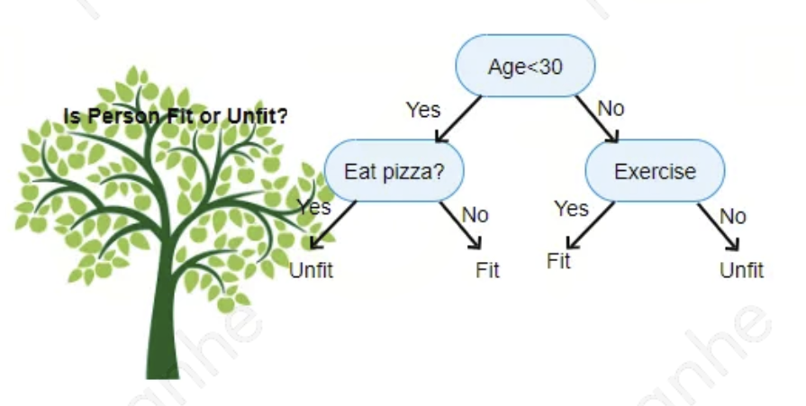

# 决策树

## 简介

决策树（Decision Tree）算法采用树形结构，使用层层推理来实现最终的分类。决策树易于实现，可解释性强，模拟人类的直观思维，一步步分类。决策树的目标就是产生一棵泛化能力强，即处理未见事例能力强的决策树。

### 优缺点

#### 优点

- 复杂度不高

#### 缺点

- 容易过拟合

## 算法

### 数据

- $X\in R^n$
- $Y$：类型

### 表示：假设

假设空间 H 是所有由特征构成的决策树，样本的属性作为决策树的结点，会存在三种节点：

- 根节点：包含样本的全集
- 内部节点：对应特征属性测试
- 叶节点：就是树最底部的节点，代表决策的结果

节点之间存在父子关系。比如根节点会有子节点，子节点会有子子节点，但是到了叶节点就停止了，叶节点不存在子节点。那么在构造过程中，要解决三个重要的问题：选择哪个特征作为根节点；选择哪些特征作为子节点；什么时候停止并得到目标状态，即叶节点。

### 评估

#### 代价函数：信息纯度

特征选择决定了使用哪些特征来做判断。在训练数据集中，每个样本的属性可能有很多个，不同属性的作用有大有小。因而特征选择的作用就是筛选出跟分类结果相关性较高的特征，也就是分类能力较强的特征。在特征选择中通常使用的准则是：信息纯度，也就是在某个特征分类之下的纯度特别高。在构造决策树的时候，会基于纯度来构建。而经典的 “不纯度”的指标有三种，分别是信息增益（ID3 算法）、信息增益率（C4.5 算法）以及基尼指数（Cart 算法）。

可以把决策树的构造过程理解成为寻找纯净划分的过程。数学上，可以用纯度来表示，纯度换一种方式来解释就是让目标变量的分歧最小。信息熵（entropy）表示了信息的混乱性，即不确定度。信息熵越大，纯度越低。当集合中的所有样本均匀混合时，信息熵最大，纯度最低。在信息论中，随机离散事件出现的概率存在着不确定性。为了衡量这种信息的不确定性，信息学之父香农引入了信息熵的概念。

假定当前样本集 D 中有 $|Y|$ 个类别，第 $k$ 类样本所占的比例为 $p_k(k=1,2,...,|Y|)$，则 D 的信息增益定义为：$Ent(D)=-\sum_{k=1}^{|Y|}p_klog_2p_k$。信息熵越小，纯度越高。

选择好特征后，就从根节点出发，对节点计算所有特征的信息增益，选择信息增益最大的特征作为节点特征，根据该特征的不同取值建立子节点；对每个子节点使用相同的方式生成新的子节点，直到信息增益很小或者没有特征可以选择为止。

### 优化：学习算法

决策树的学习算法就是构造一棵完整的决策树，具体来说就是比较每个特征带来的信息纯度的提升，从而选取最佳值。决策树生成的过程是一个递归的过程，其结束条件分为 3 类：

- 当前节点不包含样本：当前节点标记为叶子节点，类别为父节点所含样本最多的类别
- 当前节点包含的样本全属于同一类别：当前节点标记为叶子节点，类别为该类别
- 当前节点包含的样本的所有属性都相同，无法再划分：当前节点标记为叶子节点，类别为样本最多的类别

#### ID3算法

##### 信息增益

ID3  算法计算的是信息增益，信息增益指的就是划分可以带来纯度的提高，信息熵的下降。它的计算公式，是父亲节点的信息熵减去所有子节点的信息熵。在计算的过程中，会计算每个子节点的归一化信息熵，即按照每个子节点在父节点中出现的概率，来计算这些子节点的信息熵。

假设属性 $a$ 有 $V$ 个可能的取值 ${a^1,a^2,...a^V}$，若使用 $a$ 来对样本集 $D$ 进行划分，会产生 $V$ 个分支结点，其中第 $v$ 个分支结点包含了 $D$ 中所有在属性 $a$ 上取值为 $a^v$ 的样本 $D^v$。可计算得 $D^v$ 的信息熵，并结合 $D^v$ 的权重 $|D^v|/|D|$ 可计算得出属性 $a$ 对样本集 $D$ 的信息增益为：$Gain(D,a)=Ent(D)-\sum_{v=1}^V\frac{|D^V|}{|D|}Ent(D^v)$。一般而言，信息增益越大，意味着使用属性 $a$ 来进行划分所得的“纯度提升”越大。

选择属性 $a_*= arg max_{a\in A}Gain(D,a)$

##### 缺陷

ID3 算法的缺陷在于倾向于选择取值比较多的属性。如果把“编号”作为一个属性，那么“编号”将会被选为最优属性 ，但实际上“编号”是无关属性的，它对分类并没有太大作用。

#### C4.5算法

##### 信息增益率

因为 ID3 在计算的时候，倾向于选择取值多的属性。为了避免这个问题，C4.5 采用信息增益率的方式来选择属性。信息增益率 = 信息增益 / 属性熵。

信息增益率定义为：$Gain_ratio(D,a)=\frac{Gain(D,a)}{IV(a)}$，其中 $IV(a)=-\sum_{v=1}^V\frac{|D^v|}{|D|}log_2\frac{|D^v|}{|D|}$ 为属性 $a$ 的固有值。属性 $a$ 的可能取值越多，则 $IV(a)$ 的值通常越大。当属性有很多值的时候，相当于被划分成了许多份，虽然信息增益变大了，但是对于 C4.5 来说，属性熵也会变大，所以整体的信息增益率并不大。

##### 处理数据类型

###### 特征值离散化

C4.5 可以处理连续属性的情况，对连续的特征进行离散化的处理。比如打篮球存在的“湿度”属性，不按照“高、中”划分，而是按照湿度值进行计算，那么湿度取什么值都有可能。C4.5 采用“二分法”来实现连续属性离散化，它取临近两个属性值的平均数作为属性值来计算 C4.5 的信息增益率。

#### CART 算法

CART（Classification And Regression Tree）算法，中文叫做分类回归树。

##### GINI系数

在经济学中，基尼系数是用来衡量一个国家收入差距的常用指标。当基尼系数大于 0.4 的时候，说明财富差异悬殊。基尼系数在 0.2-0.4  之间说明分配合理，财富差距不大。基尼系数本身反应了样本的不确定度。当基尼系数越小的时候，说明样本之间的差异性小，不确定程度低。分类的过程本身是一个不确定度降低的过程，即纯度的提升过程。所以 CART 算法在构造分类树的时候，会选择基尼系数最小的属性作为属性的划分。

GINI 系数的计算公式为：$Gini(D)=\sum_{k=1}^{|y|}\sum_{k’=k}p_kp_{k'}=1-\sum_{k=1}^{|y|}p_k^2$，其中 $p_k$ 表示选取样本属于类别 $k$ 的概率。Gini 系数反映了在数据集 $D$ 中随机去 2 个样本，其标记类别不一致的概率。因此，$Gini(D)$ 越小，则数据集 $D$ 的纯度越高。

数据集 $D$ 的基尼系数为其各个类别的归一化基尼系数之和：$Gini\_index(D,a)=\sum_{v=1}^{V}\frac{|D^v|}{|D|}Gini(D^v)$。

在属性特征的集合 $A$ 中选择使得划分后 Gini 系数最小的属性特征作为最优划分属性，即：$arg min_{a\in A}Gini\_index(D,a)$。

### 使用

预测时，在树的内部节点处用某一属性值进行判断，根据判断结果决定进入哪个分支节点，直到到达叶节点处，得到分类结果。这是一种基于 if-then-else 规则的有监督学习算法，决策树的这些规则通过训练得到，而不是人工制定的，适用于任何监督学习任务。

其具体使用步骤为：

- 从根节点开始，对实例的某一特征进行选择，根据测试结果，将实例分配到其子结点
- 递归地对实例进行测试并分配，直至达到叶结点
- 将实例分配到叶结点的类中

## 剪枝

剪枝就是给决策树瘦身，是对付“过拟合”的主要手段。造成过拟合的原因之一就是因为训练集中样本量较小。如果决策树选择的属性过多，构造出来的决策树一定能够“完美”地把训练集中的样本分类。但是这样就会把训练集中一些数据的特点当成所有数据的特点，但这个特点不一定是全部数据的特点，这就使得这个决策树在真实的数据分类中出现错误，也就是模型的“泛化能力”差。泛化能力指的分类器是通过训练集抽象出来的分类能力，也可以理解是举一反三的能力。如果太依赖于训练集的数据，那么得到的决策树容错率就会比较低，泛化能力差。因为训练集只是全部数据的抽样，并不能体现全部数据的特点。

决策树的构造通过类似信息增益之类的指标进行，而决策树的剪枝则通过度量“泛化能力”来实现。一般来说，剪枝可以分为“预剪枝”（Pre-Pruning）和“后剪枝”（Post-Pruning）：

### 预剪枝

预剪枝是在决策树构造时就进行剪枝。方法是在构造的过程中对节点进行评估，如果对某个节点进行划分，在验证集中不能带来准确性的提升，那么对这个节点进行划分就没有意义，这时就会把当前节点作为叶节点，不对其进行划分。预剪枝基于“贪心”算法，本质是禁止某些分支展开，所以可能会带来“欠拟合”的风险。

### 后剪枝

后剪枝就是在生成决策树之后再进行剪枝，通常会从决策树的叶节点开始，逐层向上对每个节点进行评估。如果剪掉这个节点子树，与保留该节点子树在分类准确性上差别不大，或者剪掉该节点子树，能在验证集中带来准确性的提升，那么就可以把该节点子树进行剪枝。方法是用这个节点子树的叶子节点来替代该节点，类标记为这个节点子树中最频繁的那个类。后剪枝通常比预剪枝给决策树带来更多的分支，一般情况下欠拟合风险较小，泛化能力也往往优于预剪枝。但后剪枝是在生成决策树之后，因此训练开销要大得多。

#### C4.5 后剪枝（悲观）

ID3 构造决策树的时候，容易产生过拟合。在 C4.5 中，会在决策树构造之后采用悲观剪枝（PEP），用于提升决策树的泛化能力。悲观剪枝是后剪枝技术中的一种，通过递归估算每个内部节点的分类错误率，比较剪枝前后这个节点的分类错误率来决定是否对其进行剪枝。这种剪枝方法不再需要一个单独的测试数据集。

#### CART 后剪枝

CART 决策树的剪枝主要采用的是 CCP（Cost-Complexity Prune）方法，它是一种后剪枝的方法，中文叫做代价复杂度。这种剪枝方式用到一个指标叫做节点的表面误差率增益值，以此作为剪枝前后误差的定义。用公式表示则是：$\alpha=\frac{C(t)-C(T_t)}{|T_t|-1}$。其中 Tt 代表以 t  为根节点的子树，C(Tt) 表示节点 t 的子树没被裁剪时子树 Tt 的误差，C(t) 表示节点 t 的子树被剪枝后节点 t  的误差，|Tt|代子树 Tt 的叶子数，剪枝后，T 的叶子数减少了|Tt|-1。所以节点的表面误差率增益值等于节点 t  的子树被剪枝后的误差变化除以剪掉的叶子数量。

因为希望剪枝前后误差最小，所以要寻找的就是最小α值对应的节点，把它剪掉。这时候生成了第一个子树。重复上面的过程，继续剪枝，直到最后只剩下根节点，即为最后一个子树。得到了剪枝后的子树集合后，我们需要用验证集对所有子树的误差计算一遍。可以通过计算每个子树的基尼指数或者平方误差，取误差最小的那个树，得到想要的结果。

## Lab

- [决策树 分类 Iris](20_iris-dt-classify.ipynb)
- [决策树 分类 Iris](21_iris-dt-classify.ipynb)
- [决策树 分类 Iris](22_iris-dt-classify.ipynb)
- [决策树 分类 Body](30_body-dt-classify.ipynb)
- [决策树 分类 Titanic](35_titanic-dt-classify.ipynb)

