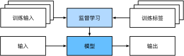

# 监督学习

## 简介

监督学习（supervised learning）擅长在“给定输入特征”的情况下预测标签。每个“特征-标签”对都称为一个样本（example）。其目标是生成一个模型，能够将任何输入特征映射到标签（即预测）。

监督学习之所以能发挥作用，是因为在训练参数时，我们为模型提供了一个数据集，其中每个样本都有真实的标签。用概率论术语来说，我们希望预测“估计给定输入特征的标签”的条件概率。

监督学习的学习过程一般可以分为三大步骤：

1. 从已知大量数据样本中随机选取一个子集，为每个样本获取真实标签。有时，这些样本已有标签（例如，患者是否在下一年内康复？）；有时，这些样本可能需要被人工标记（例如，图像分类）。这些输入和相应的标签一起构成了训练数据集；
2. 选择有监督的学习算法，它将训练数据集作为输入，并输出一个“已完成学习的模型”；
3. 将之前没有见过的样本特征放到这个“已完成学习的模型”中，使用模型的输出作为相应标签的预测。

## 算法

- 分类：预测的是离散值。“哪一个”的问题叫做分类（classification）问题，它希望模型能够预测样本属于哪个类别（category，正式称为类 class）。
  - K邻近（KNN）：通过搜索 K 个最相似的实例（邻居）的整个训练集并总结那些 K 个实例的输出变量，对新数据点进行预测。
  - 逻辑回归：逻辑回归是用于处理因变量为分类变量的回归问题，常见的是二分类或二项分布问题，也可以处理多分类问题。
  - 朴素贝叶斯分类：贝叶斯分类法是基于贝叶斯定理的统计学分类方法。它通过预测一个给定的元组属于一个特定类的概率来进行分类。朴素贝叶斯分类假定一个属性值在给定类的影响独立于其他属性的，即类条件独立性。
  - SVM：支持向量机把分类问题转化为寻找分类平面的问题，并通过最大化分类边界点距离分类平面的距离来实现分类。
  - 决策树：决策树是一种简单但广泛使用的分类器，它通过训练数据构建决策树，对未知的数据进行分类。
  - 随机森林：
- 回归：当标签取任意连续数值时，被称之为回归问题，此时的目标是生成一个模型，使它的预测非常接近实际标签值。
  - 线性回归：线性回归是处理回归任务最常用的算法之一,该算法期望使用一个超平面拟合数据集（只有两个变量的时候就是一条直线）。
  - 回归树：回归树（决策树的一种）通过将数据集重复分割为不同的分支而实现分层学习，分割的标准是最大化每一次分离的信息增益。这种分支结构让回归树很自然地学习到非线性关系。

神经网络也属于分类算法，它从信息处理角度对人脑神经元网络进行抽象，建立某种简单模型，按不同的连接方式组成不同的网络。但是因为其知识体系庞大，所以后续会单独介绍。