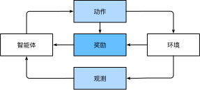

# 强化学习

## 简介

在强化学习（Reinforcement Learning）问题中，智能体（agent）在一系列的时间步骤上与环境交互。在每个特定时间点，智能体从环境接收一些观察（observation），并且必须选择一个动作（action），然后通过某种机制（有时称为执行器）将其传输回环境，最后智能体从环境中获得奖励（reward）。此后新一轮循环开始，智能体接收后续观察，并选择后续操作，依此类推。强化学习的目标是产生一个好的策略（policy），强化学习智能体选择的“动作”受策略控制，即一个从环境观察映射到行动的功能。

强化学习和监督学习、无监督学习 最大的不同就是不需要大量的“数据喂养”。而是通过自己不停的尝试来学会某些技能。类似于监督学习，但 label 不会给出好坏，只会对最终结果打个分。

当环境可被完全观察到时，强化学习问题被称为马尔可夫决策过程（markov decision process）。当状态不依赖于之前的操作时，我们称该问题为上下文赌博机（contextual bandit problem）。当没有状态，只有一组最初未知回报的可用动作时，这个问题就是经典的多臂赌博机（multi-armed bandit problem）。

### Markov决策过程

为了简化问题，可以这样建模世界：可以认为在某一个时刻整个世界处于状态 S1，当智能体进行了某一个行动之后，这个世界的状态变化为了 S2。智能体之所以能够做出这一行动，是因为其心中有一个目标，并且从这个世界中得到了一定的反馈。

例如：我们想要喝水（目标），身边有一个杯子和一个饮水机（状态S1），我们会观察杯子和饮水机的位置，再伸手去拿取杯子（行动），然后将杯子靠近饮水机（反馈），到达饮水机出水位置之后（状态S2），饮水机开始出水，之后我们再将杯子举到嘴边就能喝到水了。 这个简单的模型可以图示如下：

智能体（Agent）通过观察这个世界（Environment）的状态（State: s），经过智能决策，开展了一些行动（Actions:  a），这些行动进而引起了这个世界的状态变化。智能体从这些变化的状态中获得关于之前行动的反馈（Reward:  r），从而指导后续的行动决策。就这样，整个世界周而复始的一直循环下去。

从这个模型出发，由于因果律的存在，是不是知道了S1这个初始状态及智能体做出的行动 A 之后，就可以直接计算下一状态 S2 了呢？理论是可行的，但实际情况要更复杂一些，因为状态实在太多太多了，通常无法直接建模所有的状态。这时，可以用统计学的方式来解决这个问题。可以认为在做出某一行动之后，这个世界的状态只是有一定概率会转换为 S2，同时也有一定的概率会转换为 $S2_1$ 等等。这样就算建模的状态不全，也可以相对较好的描述这个系统。引入统计学的思维，也就引入了不确定性，虽然如此，但是却带来了更合理的描述系统的方式和系统层面的确定性。

以上描述的模在强化学习里被称作 Markov 决策过程 MDP（Markov Decision Process），这里面的不确定性也就是Markov特性。

## 价值迭代算法

定义公式：

表示每个动作的价值，其中：

- s 表示当前状态；
- a 表示动作；
- s' 表示下一个状态；
- T(s, a, s') 表示在状态 s、执行动作 a 转换到状态 s' 的概率；
- R(s, a, s') 表示在状态 s、执行动作 a 转换到状态 s' 得到的奖励。

表示每个格子的价值，其中：

- s表示当前状态
- a表示动作

一般会引入一个额外的 γ 参数，对下一个状态的价值打一定的折扣，这是因为当前获得的奖励一般会优于下一个状态的价值的，毕竟下一个状态的价值只是一个估计值。这时，上述第一个公式变为：

于是算法就可以描述为：

- 对每一个状态，初始化 V := 0
- 循环，直到 V 收敛：
- 对每一个状态，

这里为判断 V 是否收敛，可以检查当前这次迭代是否会更新 V 的值。

## 具体算法

### 传统

### 深度学习

- DQN：DQN（Deep Q-Network）的核心是一个 Q 值迭代的算法，就是价值迭代公式中的关于行动价值的公式的一个迭代形式，算法也是不断迭代直到收敛。

## Ref

1. [强化学习入门](https://insights.thoughtworks.cn/reinforcement-learning/)
